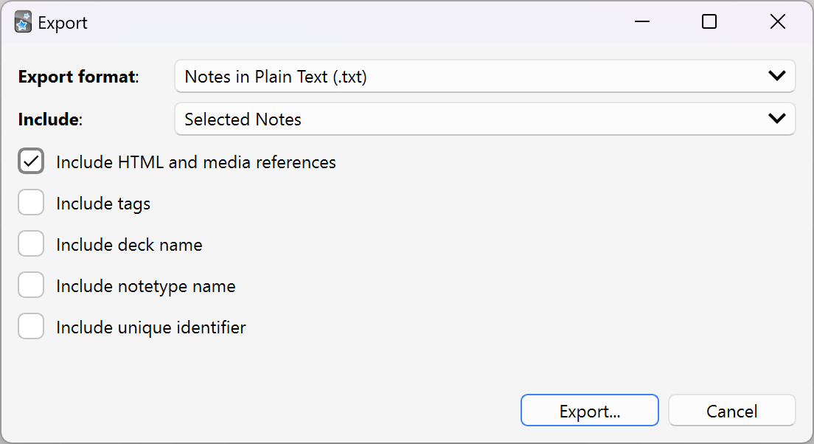

1. exporting all selected notes with media references



2. extract media paths from the exported file
3. write a python script merging all selected audios into one

```python
import os
import subprocess
import pandas as pd
from concurrent.futures import ThreadPoolExecutor, as_completed
from tqdm import tqdm
import random

AUDIO_DIRECTORY = r"C:\Users\kyle\AppData\Roaming\Anki2\Eng\collection.media"
SILENT = r"C:\Users\momo\Home\Projects\Anki\silent.mp3"

list_file_path = "../notes.txt"
df = pd.read_csv(
    list_file_path,
    sep="\t",
    header=None,
    names=[
        "word", "lemma", "context", "sentence", "examples", "symbol", "voc", "def",
        "word_sound", "sentence_sound"
    ],
)

word_audio_names = df["word_sound"].apply(lambda x: x.strip()[7:-1]).tolist()
df["sentence_sound"] = df["sentence_sound"].fillna("")
sentence_audio_names = df["sentence_sound"].apply(lambda x: x.strip()[7:-1]).tolist()

audio_paths = [os.path.join(AUDIO_DIRECTORY, item) for item in word_audio_names] + [
    os.path.join(AUDIO_DIRECTORY, item) for item in sentence_audio_names if item != ""
]


def normalize_audio(input_file, output_file):
    try:
        command = [
            "ffmpeg", "-loglevel", "quiet", "-y", "-i", input_file, "-ar", "24000",
            "-ab", "96k", output_file
        ]
        subprocess.run(command, check=True)
        return output_file
    except subprocess.CalledProcessError as e:
        return None


def normalize_audio_multithreaded(file_list, output_dir, max_workers=16):
    if not os.path.exists(output_dir):
        os.makedirs(output_dir)
        print("start normalizing audios")
        with ThreadPoolExecutor(max_workers=max_workers) as executor:
            futures = [
                executor.submit(normalize_audio, input_file,
                                os.path.join(output_dir, os.path.basename(input_file)))
                for input_file in file_list
            ]
            for _ in tqdm(as_completed(futures), total=len(file_list)):
                pass
    else:
        print("files has prepared well")


normalize_audio_multithreaded(audio_paths, "temp")

audio_paths = [(w, s) for w, s in zip(word_audio_names, sentence_audio_names)]
random.shuffle(audio_paths)

with open("file_list.txt", "w") as f:
    for w, s in audio_paths:
        f.write(f"file '{os.path.join('temp', w)}'\n")
        f.write(f"file silent.mp3\n")
        f.write(f"file '{os.path.join('temp', w)}'\n")
        f.write(f"file silent.mp3\n")
        if s != "":
            f.write(f"file '{os.path.join('temp', s)}'\n")
            f.write(f"file silent.mp3\n")
            f.write(f"file silent.mp3\n")

command = [
    "ffmpeg", "-y", "-f", "concat", "-safe", "0", "-i", "file_list.txt", "-c", "copy",
    "output.mp3"
]
subprocess.run(command, check=True)
```
