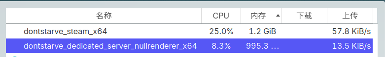
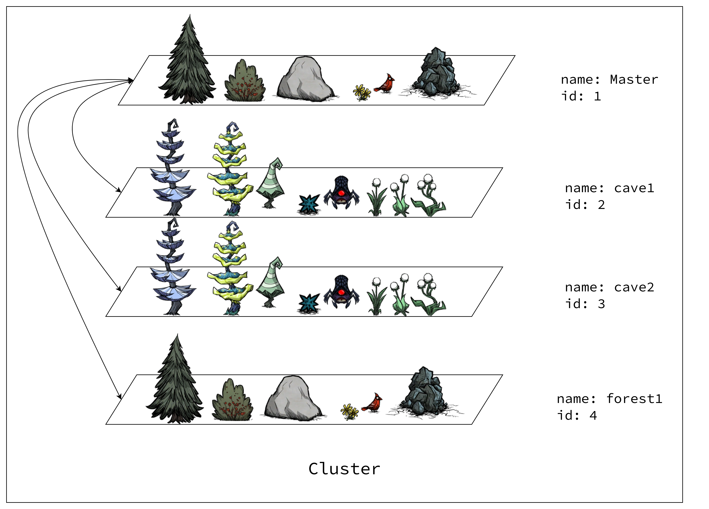
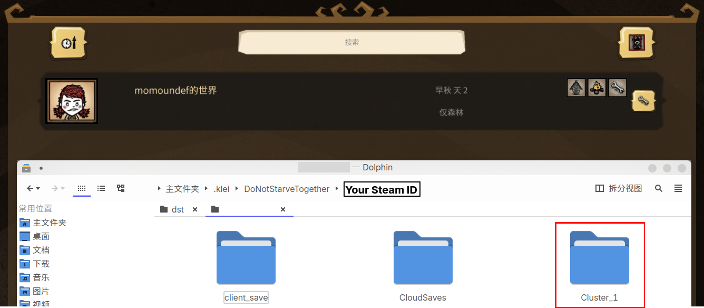
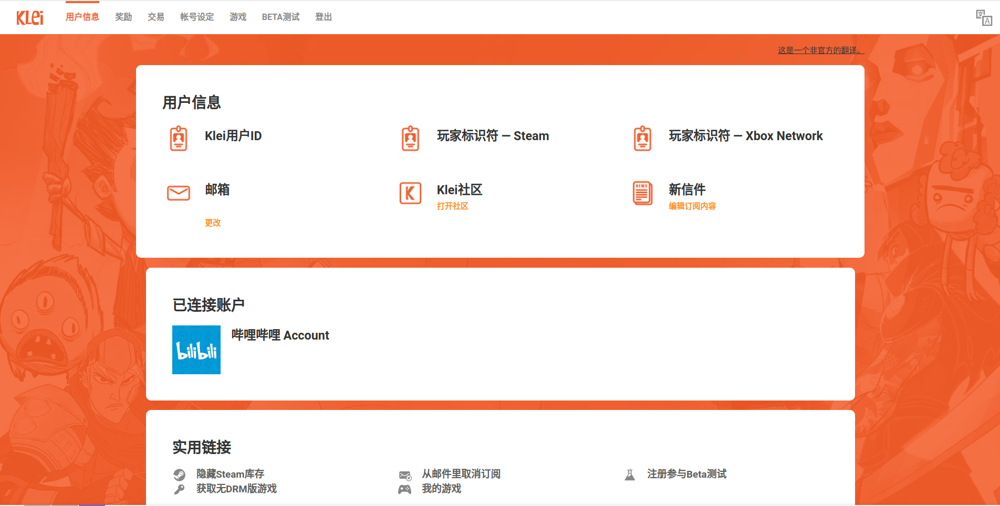
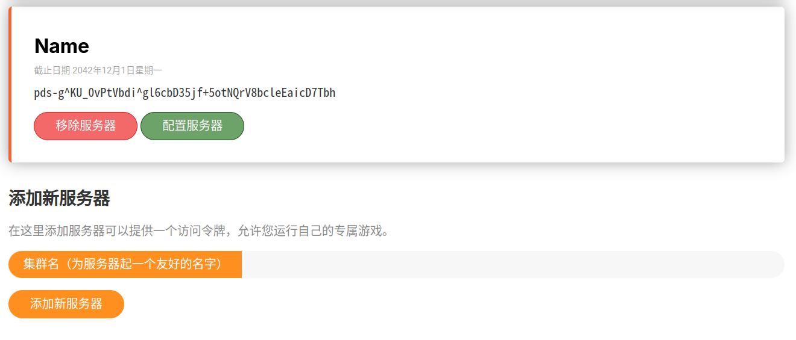
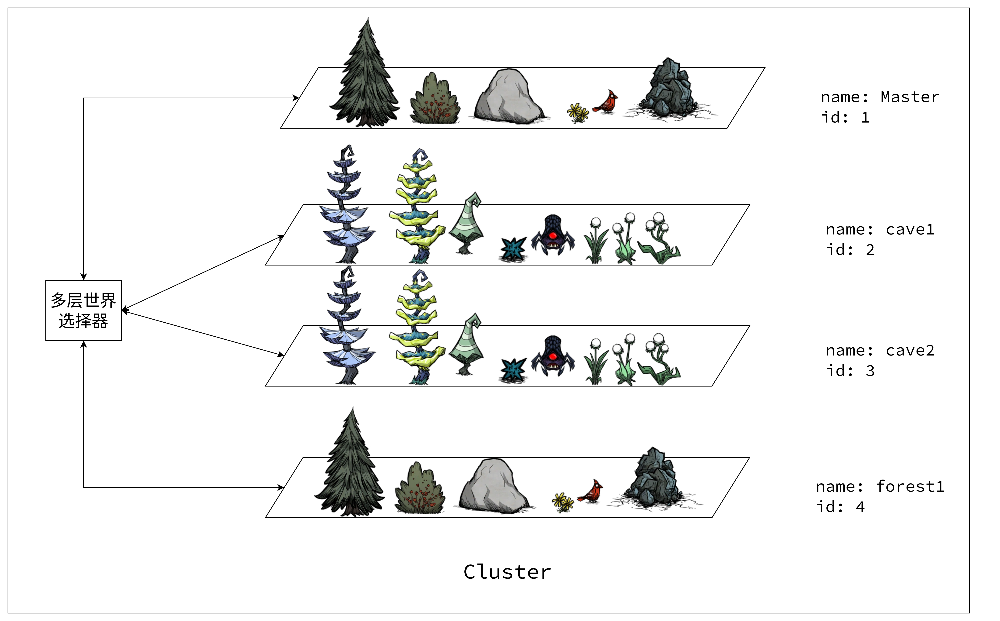

> 此文全程处于`linux`环境，阅读此文需具备一些`linux`使用经验。

解决饥荒卡顿有两个方法，如果你是单人联机玩家，可以添加[长路独行](https://steamcommunity.com/sharedfiles/filedetails/?id=2657513551)模组，开启后就可以获得与单机版相同的游戏体验，此模组的原理的注意事项可以[点此查看](https://dont-starve-mod.github.io/zh/dsa_index/)。 
对于联机玩家，可以搭建专用服务器优化卡顿。饥荒联机版专用服务器 (Don't Starve Together Dedicated Server) 是由 klei 官方提供的一个工具，购买饥荒联机版后，在Steam 的“库”页面勾选 "TOOLS" 后就可以看到了。
专用服务器可以在云服务器或PC上运行。如果你的电脑配置还可以，并且不要求服务器全天运行，完全可以在自己电脑上搭建专用服务器。
运行专用服务器每个世界大约需要`1G`内存，同时运行游戏本身也需要内存，因此内存最好在`8G`以上。如图1所示，第一个进程是游戏本身，占用了`1.2G`的内存，第二个进程是专用服务器，占用了`995M`左右的内存。



## 饥荒存档的构成

> 使用游戏本身创建的存档最多可以有一个森林和一个洞穴。但是饥荒专用服务器支持一个存档内包含任意多个森林和洞穴。

专用服务器的运行单位是一个世界，而不是一个存档。比如说，一个存档中包括2个森林和2个洞穴，那么就需要启动4个专用服务器的进程实例。当然，你也可以不运行全部的世界，如果你不打算去某个世界，完全可以不启动它。这些进程通过网络通信，由于这种灵活的方式，你完全可以将一个存档中的不同的世界运行在不同的电脑上 (当然一般不需要这么做，除非你的世界太大了以至于一台电脑运行起来吃力)。

唯一的限制是，每个存档必须有且仅有一个主世界 (Master Shard)，所有其他的世界都需要绑定到主世界。为了区分，每个世界都有一个唯一的`id`，通过给洞穴入口或洞穴出口绑定不同的`id`，玩家可以通过在多个世界之间穿越。旺达的溯源表也绑定了世界的`id`，因此可以穿越到不同的世界。如图2所示，这是一个拥有两个森林和两个洞穴的世界。其中一个森林是主世界，箭头代表可以通过洞穴入口或洞穴出口进出另一个世界。



这个世界对应的存档结构如下:

```bash
.
├── [drwxr-xr-x]  Master
├── [drwxr-xr-x]  Cave1
├── [drwxr-xr-x]  Cave2
├── [drwxr-xr-x]  Forest1
├── [-rw-r--r--]  cluster.ini
└── [-rw-r--r--]  cluster_token.txt
```

可以看出，每个世界都对应一个文件夹。此外，`cluster.ini`存放了世界的一些参数设置，`cluster_token.txt`里存放了用户的身份令牌 (身份令牌的获取参见下一章)。这些就是一个 存档的完整内容。
也可以查看`~/.klei/DontStarveTogether/$SteamUserID/`目录。如果你在本地创建了存档，那么这个目录下就会有以`Cluster_X`格式命名的文件夹，其中`X`是此存档在游戏中显示的位置。如图3所示，我创建了一个存档，那么此文件夹中就有一个`Cluster_1`。



查看目录结构，可以看出我只添加了一个主世界，没有添加洞穴。只有在专用服务器上运行的存档才需要`cluster_token.txt`，因此这里没有。
```

```bash
Cluster_1
├── Master
└── cluster.ini
```

## 在本地运行专用服务器

### 准备存档文件

在游戏中创建存档，添加好要启用的模组并设置好世界的参数后生成世界。等待世界生成，进入选人物的步骤后，断开连接。

> 一定要添加洞穴，否则存档无法在专用服务器中运行。

进入`~/.klei/DontStarveTogether/$SteamUserID/`目录，将刚刚创建的存档`Cluster_X`(`X`是此存档在游戏中显示的位置)移动到`~/.klei/DontStarveTogether/`中。

```bash
cd ~/.klei/DontStarveTogether/$SteamUserID/
mv Cluster_X ..
```

使用浏览器打开[Klei Account](https://accounts.klei.com/login)，登录自己的`Klei`账号，可以使用`Steam`登录。登录成功后进入如下页面。



点击导航栏中的`游戏`，在游戏列表中点击`《饥荒：联机版》的游戏服务器`，如下图所示。


随便起一个名字，点击`添加新服务器`，然后复制生成的以`pds-g^`开头的代码，如下图所示。



在`~/.klei/DontStarveTogether/Cluster_X`中创建`cluster_token.txt`文件，内容为刚刚复制的代码。

```bash
echo "pds-g^..." > cluster_token.txt
```

至此，存档文件就准备好了。

### 准备专用服务器和模组

在`Steam`中安装`Don't Starve Together Dedicated Server`，进入安装目录 (安装目录可以在`Steam`的游戏设置中找到)。
如果你的存档添加了模组，则需要修改`mods`文件夹下的`dedicated_server_mods_setup.lua`文件。专用服务器启动时，会根据这个文件的内容自动更新模组，如果你只在存档中添加了模组但是没有修改这个文件，则模组会添加失败。将需要添加的模组的`id`以如下这种格式添加到此文件中即可。

```lua
ServerModSetup("1438233888") --多层世界选择器
ServerModSetup("1418746242") --汉化增强 Chinese++
ServerModSetup("666155465") --show me
```

模组的`id`可以通过`Steam`创意工坊中的链接查看。在`Steam`中模组的详情页面右击空白处，选择`Copy Page URL`。链接末尾的`?id=`后接的就是它的`id`。例如`Show Me`的创意工坊链接为`https://steamcommunity.com/sharedfiles/filedetails/?id=666155465`，其`id`为`666155465`。 
除了这种方式，还可以查看此存档中主世界目录中的`modoverrides.lua`文件，这个文件保存了当前世界启用的模组的设置。格式如下所示，其中`workshop-`后接的数字就是模组的`id`。

```lua
return{
  ["workshop-1418746242"]={
      ["configuration_options"]={ ["clearfont"]=true，
      ["eventplus"]=true，
      ["extratrans"]=true 
    },
    ["enabled"]=true 
  }
}
```

如下命令会根据`modoverrides.lua`文件自动生成`dedicated_server_mods_setup.lua`文件。`cd`到`modoverrides.lua`所在目录中执行如下命令，然后将生成的文件复制到`专用服务器安装目录/mods`文件夹覆盖原有文件即可。

```bash
cat ./modoverrides.lua | grep -E '\["workshop-[0-9]+"\].*' | sed  -r  's/\["workshop-([0-9]+)"\].*/ServerModSetup("\1")/g' > dedicated_server_mods_setup.lua
```

### 启动专用服务器

`cd`到安装目录中的`bin64`文件夹，执行

```bash
./dontstarve_dedicated_server_nullrenderer_x64  -console -cluster "Cluster_X" -monitor_parent_process $$ -shard Caves &
./dontstarve_dedicated_server_nullrenderer_x64  -console -cluster "Cluster_X" -monitor_parent_process $$ -shard Master
```

`-console`指定在游戏中启用控制台。 
`-cluster`指定存档的名字，这个名字和要运行的存档文件夹名对应。 
`-shard`指定世界碎片的名字。同样，这个名字也要和世界碎片的文件夹名对应。

> 在`cluster.ini`中也可以指定一个名称，这个名称是在游戏中玩家看的世界名称。而`-cluster`指定的只是文件夹的名称，在游戏中是看不到的。

## 在云服务器运行专用服务器

购买阿里云或腾讯云提供的云服务器，配置选择`1核2G`或者`2核4G`即可。安装`Debian`或`Ubuntu`操作系统，在安全组中开放`10888-10999`端口。此处以`Debian`为例。

```bash
       _,met$$$$$gg.          momo@debian 
    ,g$$$$$$$$$$$$$$$P.       ----------- 
  ,g$$P"     """Y$$.".        OS: Debian GNU/Linux 11 (bullseye) x86_64 
 ,$$P'              `$$$.     Host: VirtualBox 1.2 
',$$P       ,ggs.     `$$b:   Kernel: 5.10.0-23-amd64 
`d$$'     ,$P"'   .    $$$    Uptime: 1 min 
 $$P      d$'     ，   $$P    Packages: 444 (dpkg) 
 $$:      $$.   -    ,d$$'    Shell: bash 5.1.4 
 $$;      Y$b._   _,d$P'      Resolution: preferred 
 Y$$.    `.`"Y$$$$P"'         Terminal: /dev/pts/0 
 `$$b      "-.__              CPU: Intel i5-7300HQ (2) @ 2.496GHz 
  `Y$$                        GPU: 00:02.0 VMware SVGA II Adapter 
   `Y$$.                      Memory: 78MiB / 3919MiB 
     `$$b.
       `Y$$b.                                         
          `"Y$b._                                     
              `"""
```

- 添加`32`位支持

```bash
sudo dpkg --add-architecture i386
sudo apt update && sudo apt upgrade -y
```

- 安装依赖

```bash
sudo apt install libstdc++6:i386 libgcc1:i386 libcurl4-gnutls-dev:i386 -y
```

- 安装`SteamCMD`

```bash
# 这一步的速度视网络环境而定
mkdir -p ~/steamcmd/
cd ~/steamcmd/
wget "https://steamcdn-a.akamaihd.net/client/installer/steamcmd_linux.tar.gz"
tar -xvzf steamcmd_linux.tar.gz
```

- 准备存档文件
这一步骤与上一章中的相同，可以在本地生成存档文件夹，然后上传到服务器。

```bash
# 在服务器
mkdir -p ~/.klei/DoNotStarveTogether

# 在本地
cd ~/.klei/DoNotStarveTogether
scp -r ./Cluster_X username@xxx.xxx.xxx.xxx:~/.klei/DoNotStarveTogether/
```

- 将以下内容写入`run_server.sh`文件并赋予其执行权限。

```bash
#!/bin/bash

steamcmd_dir="$HOME/steamcmd"
install_dir="$HOME/dontstarvetogether_dedicated_server"
cluster_name="$1"
dontstarve_dir="$HOME/.klei/DoNotStarveTogether"

function fail()
{
  echo Error: "$@" >&2
  exit 1
}

function check_for_file()
{
  if [ ! -e "$1" ]; then
          fail "Missing file: $1"
  fi
}

cd "$steamcmd_dir" || fail "Missing $steamcmd_dir directory!"

check_for_file "steamcmd.sh"
check_for_file "$dontstarve_dir/$cluster_name/cluster.ini"
check_for_file "$dontstarve_dir/$cluster_name/cluster_token.txt"
check_for_file "$dontstarve_dir/$cluster_name/Master/server.ini"
check_for_file "$dontstarve_dir/$cluster_name/Caves/server.ini"

./steamcmd.sh +force_install_dir "$install_dir" +login anonymous +app_update 343050 validate +quit

check_for_file "$install_dir/bin64"

cat "$dontstarve_dir/$cluster_name/Master/modoverrides.lua" | grep -E '\["workshop-[0-9]+"\].*' | sed  -r  's/\["workshop-([0-9]+)"\].*/ServerModSetup("\1")/g' > "$install_dir/mods/dedicated_server_mods_setup.lua"

cd "$install_dir/bin64" || fail

run_shared=(./dontstarve_dedicated_server_nullrenderer_x64)
run_shared+=(-console)
run_shared+=(-cluster "$cluster_name")
run_shared+=(-monitor_parent_process $$)

"${run_shared[@]}" -shard Caves  | sed 's/^/Caves:  /' &
"${run_shared[@]}" -shard Master | sed 's/^/Master: /'
```

这个脚本是我在`Klei`官方提供的脚本的基础上优化修改而来。运行时需要提供存档文件夹的名称作为脚本的第一个参数。脚本将会检查存档文件是否完整，使用`SteamCMD`更新专用服务器并根据存档的模组设置文件`modoverrides.lua`自动生成`dedicated_server_mods_setup.lua`文件。

- 运行脚本

```bash
./run_server.sh Cluster_X
```

由于第一次运行时要下载专用服务器，速度会比较慢。当终端输出`Sim paused`时就说明启动完毕，可以在游戏中搜索加入了。

> 可以使用`tmux`或`screen`等工具，这样脚本就可以在后台运行了。

## 多层世界

理论上来说，一个存档中可以添加无数个世界。配置多层世界需要修改存档根目录中的`cluster.ini`和每个世界目录中的`server.ini`。 
首先看一下的`cluster.ini`的内容。

> TODO 文件内容分析

使用多层世界选择器可以解决给洞穴入口绑定id的麻烦。类似于路由器的工作方式，玩家选择目标世界，由多层世界选择器将玩家送到对应世界，如图7所示。



## 常见问题

### Connecting anonymously to Steam Public...: Retry Retry

无法连接到`Steam`的服务器，这一般是由于`GFW`，科学上网即可解决。

### 服务器启动失败: cluster_token.txt do not exist

检查`cluster_token.txt`是否存在，内容是否正确。

### 服务器启动失败: libcurl-gnults.so.4

安装`libcurl-gnults`。

### 全部模组没有添加成功

查看`modoverrides.lua`和`dedicated_server_mods_setup.lua`是否都存在，内容是否正确。

### 部分模组没有添加成功

因为网络原因，有时专用服务器会在下载某些模组时失败。如果运行后发现只有一部分模组，一般重新运行专用服务器即可。

### 游戏大厅内无法搜索到世界

可以通过控制台指令`c_connect("xxx.xxx.xxx.xxx"，10999，"password")`加入世界，其中第一个参数是服务器的`IP`地址，第二个参数是主世界碎片的端口号，第三个参数是世界的密码。
