## Data Preparation

The dataset contains information on the finals of the Australia Open over the years, with each row representing one match. The information includes year of the match, gender, champion's name, champion's nationality, score details, champion's seed, runner-up's name, runner-up's nationality, and runner-up's seed.

From observing the match years, the following patterns can be found:

- Although in most years there is one men's and one women's match, the total number of men's matches is 14 more than women's. This is because, during the first 14 years (1905–1921), there is no information on women's matches, possibly due to the tournament not including women's events or due to missing data.

- In 1977, there were two tournaments each for men and women, denoted as 1977-1 and 1977-2.

- From 1941 to 1945, 1916 to 1918, and in 1986, no matches were held for either gender.

Therefore, during the 121-year period from 1905 to 2025, a total of 212 matches were held, comprising 113 men's matches and 99 women's matches. Although there should have been 242 matches (121 for each gender), there were 9 years without any tournaments, 14 years without women's tournaments, and 1 year with two additional tournaments. Thus, the final count is $242 - 18 - 14 + 2 = 212$.

Additionally, from examining the nationality data of the players, it's notable that one of the countries listed is Yugoslavia, which no longer exists. Also, the "Champion Country" column contains the full country name (e.g., Australia), while the "Champion Nationality" column contains the abbreviation (e.g., AUS), making this a redundant field. In the seed information, some players have blank seeds, while others have a "U", which likely stands for "unseeded"; blanks are likely missing data and should be excluded in visual analysis. The "Mins" column records match duration, but except for the most recent four matches, all values are missing, making this column unhelpful for analysis.

In summary, in most years, two matches (one men's and one women's) were held annually, but there were some years without any matches, and some years with only men's matches. One of the countries in the dataset no longer exists. Some players have missing seed information. The "Country" and "Nationality" columns are redundant, and the "Mins" column is mostly empty. Based on these observations, the following preprocessing steps are performed:

- Standardize 1977-1 and 1977-2 to simply 1977, to allow proper date parsing.

- Remove the "Nationality" columns, as they duplicate "Country".

- Remove the "Mins" column, since it's nearly all missing.

The current format of the dataset is not ideal for certain types of data analysis. For example, if we want to count how many times a particular player appeared in the finals, we would need to separately count the number of times the player appears in the Champion column and the Runner-up column, then sum the two. Similarly, some visualizations become difficult to produce -- for instance, analyzing the seeding history of a specific player requires navigating multiple columns.

To address this, we restructured the data by merging several columns into unified fields. For example:

- The Champion and Runner-up columns were combined into a single column called Player, with a new column Role added to indicate whether the player was the Champion or Runner-up.

- The Champion Country and Runner-up Country fields were merged into one Country column.

- Similarly, seeding information was unified into a single Seed column.

Additionally, new fields can be generated through calculation and combination:

- Number of Sets Played per Match: According to tennis rules, men's matches are best-of-five (maximum 5 sets), while women's matches are best-of-three (maximum 3 sets). In Excel, this can be calculated by checking whether certain fields are empty. For example, if the 4th set is empty, it means the match ended in 3 sets. If the 5th set is empty, it means the match lasted 4 sets. Otherwise, the match went to 5 sets.

- Time Span Between First and Last Championship: For a given player, the time interval between their first and last championship can be calculated using the `MAXIFS` and `MINIFS` functions in Excel. The data range would be the "Year" column, the criteria range would be the "Player" column, and the criteria would be the current player's name.

- Winning Rate: A player's winning rate can be calculated as the number of championships won divided by the number of times they reached the final. In Excel, this can be done using the `COUNTIFS` function.

## Global Trends

The figure below shows the global distribution of player nationalities. Clearly, Australia has dominated the tournament, with 45% of finalists coming from Australia. The next most prominent country is the USA, ranking second with 18%. Additionally, a significant portion of players come from various European countries--for example, 4% from the UK, around 3% from Spain, and about 2.6% from Sweden. There is also some representation from Asia, South America, and Africa, though very limited, with most accounting for less than 1%. Notably, South Africa is the only African country with players reaching the final.

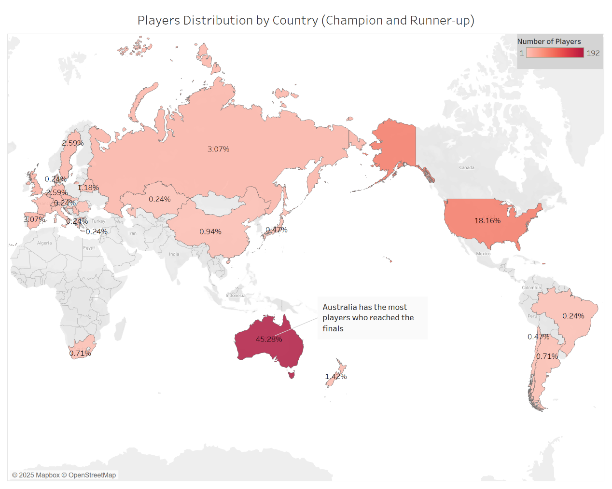

The next figure shows the countries with the most "champion" titles. The trend mirrors that of finalist nationalities: Australia ranks first, followed by the USA, and both far outpace other countries in terms of total titles. Among the rest, the UK, Switzerland, Germany, and Serbia stand out.

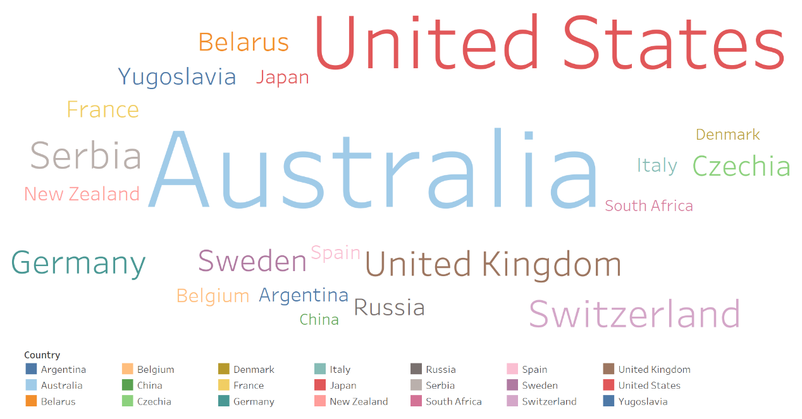

The next chart shows how the number of championships per country has changed over time. Clearly, Australia dominated the early years: from 1906 to 1978, 120 matches were held (men's and women's combined), and Australia won 93 of them--averaging 1.2 championships per year. The US and UK also had some growth during this time, but at a much slower rate--for example, the UK won only 8 championships during this period, averaging one every 9.2 years. However, since 1978, this trend has dramatically shifted. Although Australia still leads in total championships, it has not added any since 1978. Meanwhile, other countries like the USA and Serbia have been steadily increasing their counts. Especially the USA: from 15 titles in 1978 to 43 in 2021--an average of one title per year. Other countries have also emerged in this era, albeit at a slower pace, unlike the pre-1978 period where they barely appeared.

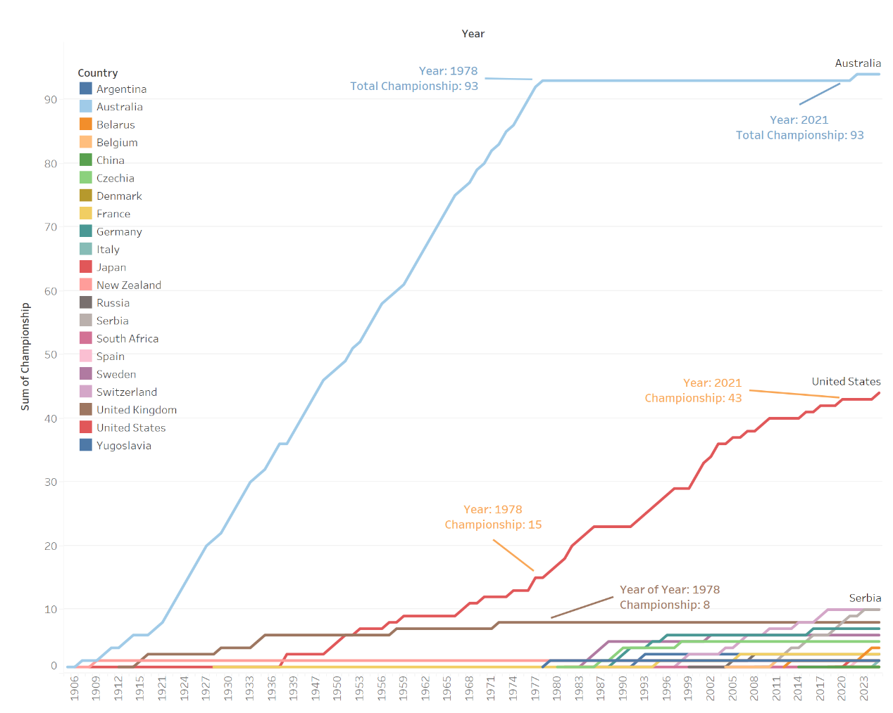

Combining insights from the world map and the time trend chart, we can conclude that although Australia dominates in total titles, most of this comes from pre-1978 years. After that, its performance plateaued, while countries like the USA and some European nations began to rise, especially the USA, which has seen a sharp increase in championships in recent decades.

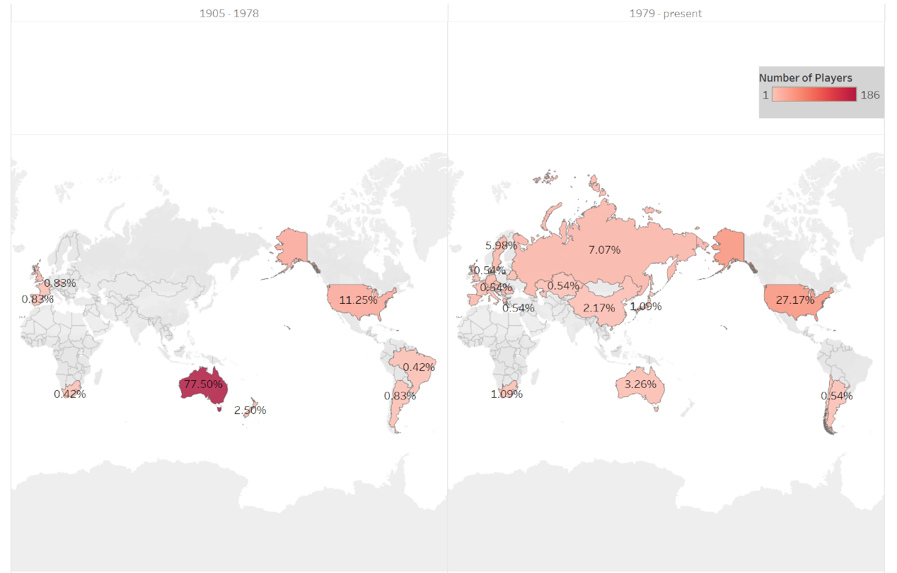

## Country-Level Analysis

The following chart shows the gender distribution of finalists from countries that have reached the final more than five times. Australia, which ranks first, has a stronger presence in men's matches--55% of its players are male. In contrast, the USA performs better in women's matches, with over 60% of its players being female. Moreover, Sweden and New Zealand are male dominated, with 11 and 6 male finalists respectively. Conversely, Belarus and Belgium have 5 and 4 female finalists respectively, and no male finalists. Other countries have both male and female finalists, but with varying gender trends--some are more female-dominant while others lean male.

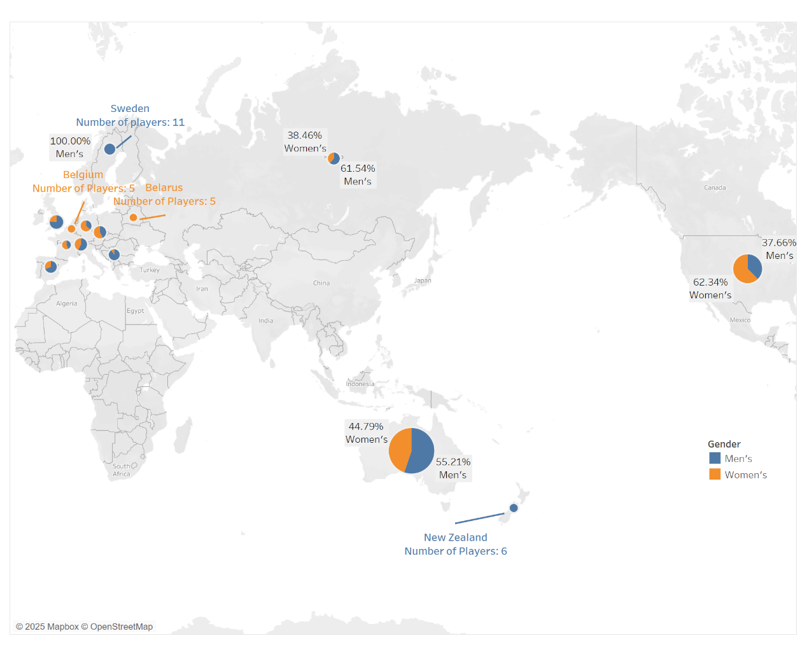

The next chart displays the distribution of championships among players from Australia, the USA, and the UK--the top three countries by total titles. From this chart, it is evident that both Australia and the USA have had exceptionally dominant players: Margaret Court (11 titles) for Australia, and Serena Williams (7 titles) for the USA--both women. That said, most championships were won by a large number of other players. For instance, in Australia, players with five or fewer titles collectively account for around 70 championships--over 70% of its total. For the USA, this proportion rises to 84%. In contrast, all UK champions have only won once each, making its 100% contribution from single-title winners.

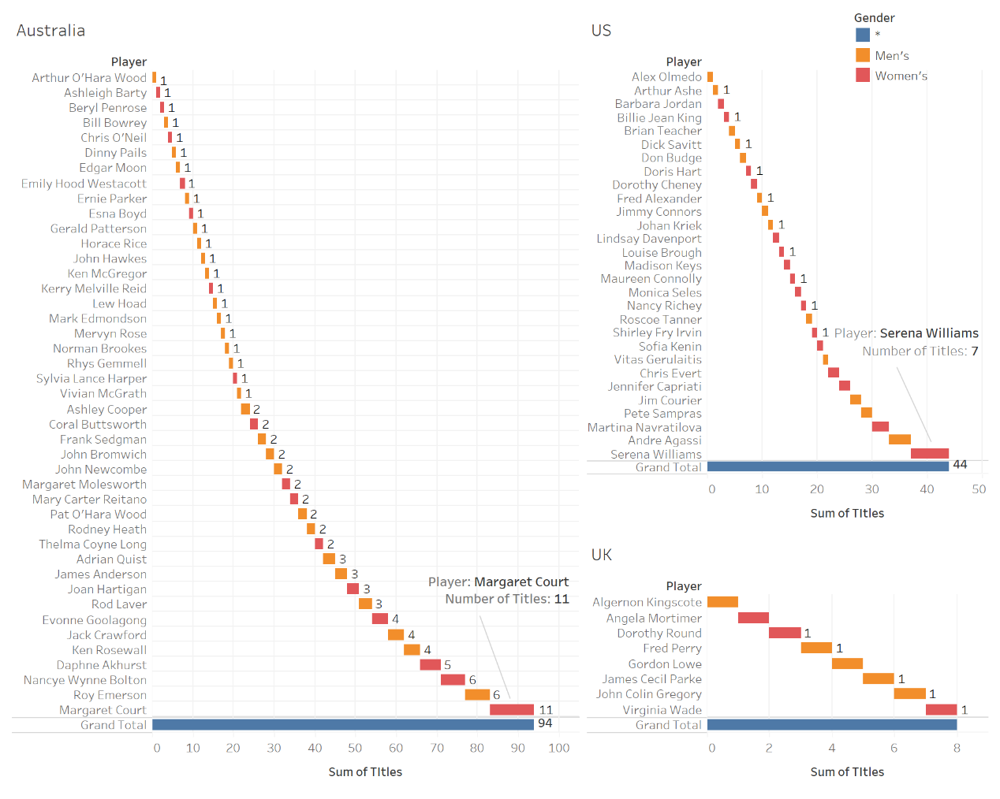

The chart below shows smaller countries with fewer championships. In these cases, no more than three players per country have won a title. The most striking example is Serbia, which ranks second in this chart by championship count: all 10 of its titles were won by a single player--Novak Djokovic (who, as will be shown in later analysis, also has the highest win rate among top players and is second in total championships).

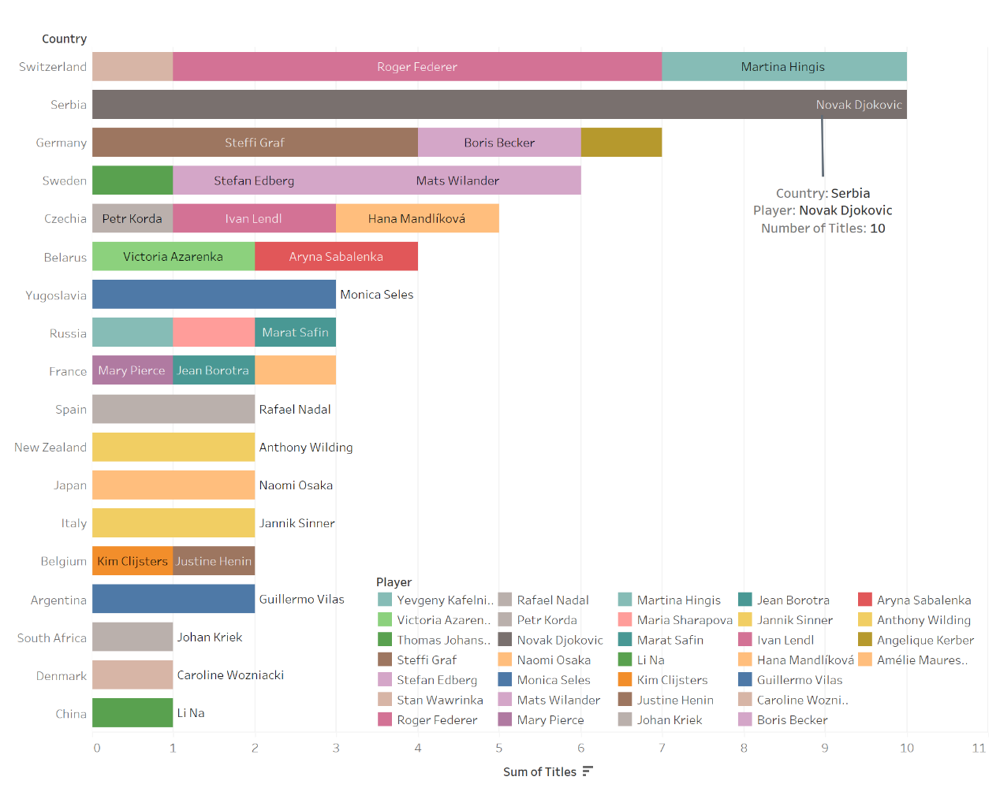

## Player-Level Analysis

The chart below shows all players who have won the championship (those who never won in the finals are not included). The font size of the names reflects the number of championships won, while the color indicates the player's country. The most eye-catching names are Margaret Court, Novak Djokovic, Roger Federer, and Serena Williams, who have won the most championships and come from Australia, Serbia, Switzerland, and the United States respectively. Additionally, it's noticeable that blue dominates the chart--this is because most champions come from Australia. There are also many names in red, but with smaller font sizes, indicating that while many American players have won championships, most of them only won once or twice.

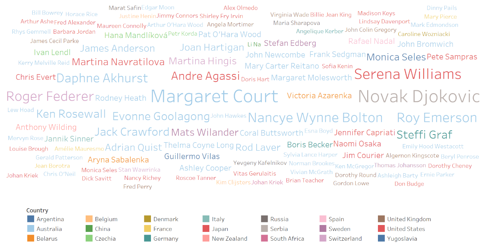

### Top Players

The chart below displays players who have won five or more championships, along with their win rates. The bars represent the number of championships won by each player, with different colors indicating their country, while the orange line shows their win rate. Margaret Court stands out with the highest number of championships (11), and both Novak Djokovic and Daphne Akhurst boast a perfect 100%-win rate. Overall, each top player has a high participation and win rate -- six of them have win rates over 80%, and one has 75%.

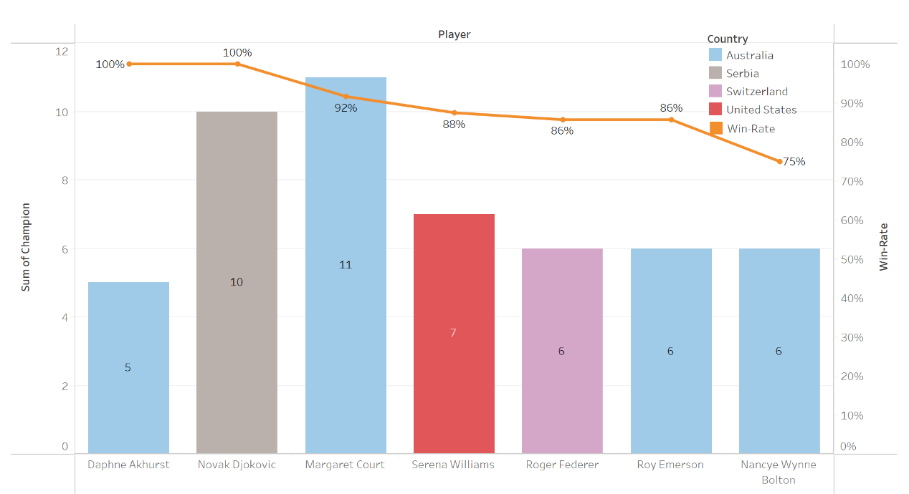

The scatter plot below compares the number of championships and runner-up finishes for each player. The horizontal axis shows championship wins, while the vertical axis shows runner-up finishes. The opacity of each dot reflects the number of players (lower opacity indicates fewer players). Players closer to the horizontal axis won more often than they lost in the finals, while those closer to the vertical axis were more likely to lose in the finals. Most players cluster near the origin, indicating that the majority have relatively few appearances in the finals.

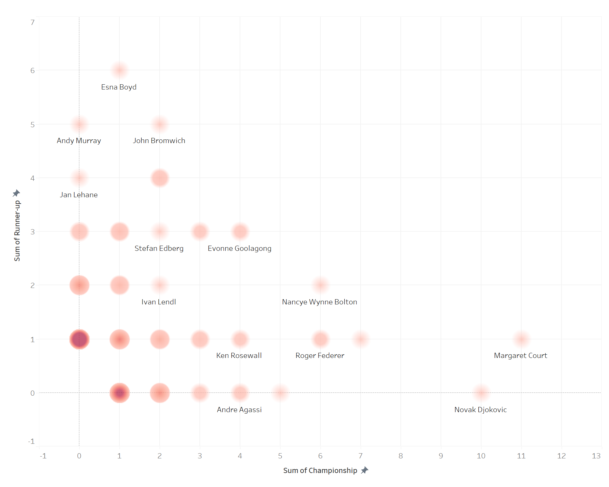

The chart below compares the active years of the seven top players (those with five or more championships). From this, we see that the earliest top player was Daphne Akhurst from Australia, who won five championships over a six-year period from 1925 to 1930. Another Australian, Nancye Wynne Bolton, reached her first final in 1936 and continued until 1951, winning six titles and finishing as runner-up twice. Roy Emerson and Margaret Court were active in a similar period, with the latter winning a record 11 championships and finishing runner-up once. Starting from 1973, there was a lull--top players who could dominate the competition were largely absent until 2003, when Serena Williams (USA), Novak Djokovic (Serbia), and Roger Federer (Switzerland) set up a new era, ending Australia's dominance. Notably, Novak Djokovic won 10 championships between 2008 and 2023, making him the player with the second-highest number of titles and the second-longest active span between first and last win.

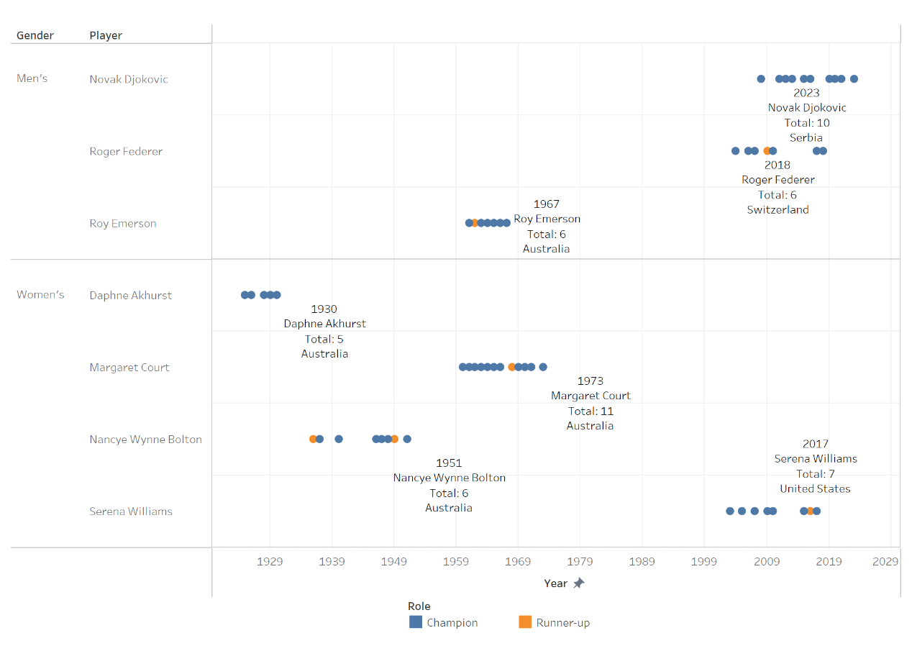

The chart below highlights the five players with the longest active spans. All of them are top players except for Ken Rosewall. His final championship win in 1972 came a full 19 years after his first in 1953. He played in five finals and won four of them. Interestingly, after finishing as runner-up in 1956, he didn't appear in another final for 15 years, returning to win again in 1971.

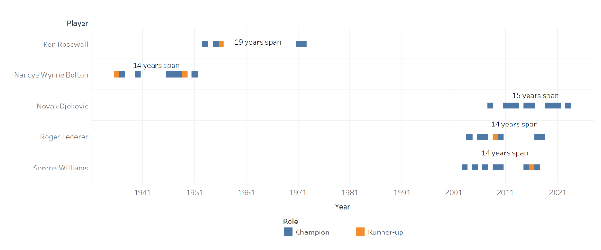

### Seed Analysis

Definition of Seed:
A "seeded player" refers to a competitor who, based on global ranking or recent performance, is specially designated and arranged in the tournament bracket. Seeds are usually assigned by the organizers based on authoritative rankings.
The chart below displays the seed distribution of players who won championships. Clearly, the most frequent winners were top seeds (seed 1), who are expected to be the most likely champions. This is followed by seeds 2 through 7, with decreasing frequencies.

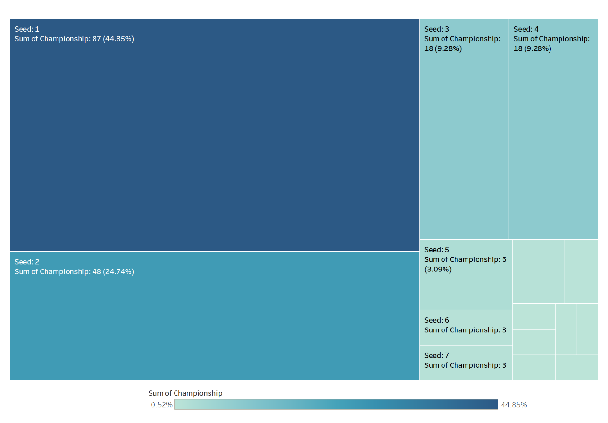

The next chart shows the seed distribution for runners-up. Seed 2 appears most frequently here, indicating that seedings were fairly accurate--those ranked second most often ended up as runners-up. This is followed by seeds 1 and 3. Unlike the champion seed chart, the fourth-largest group is the unseeded players, with 15 runners-up, making up 7% of all.

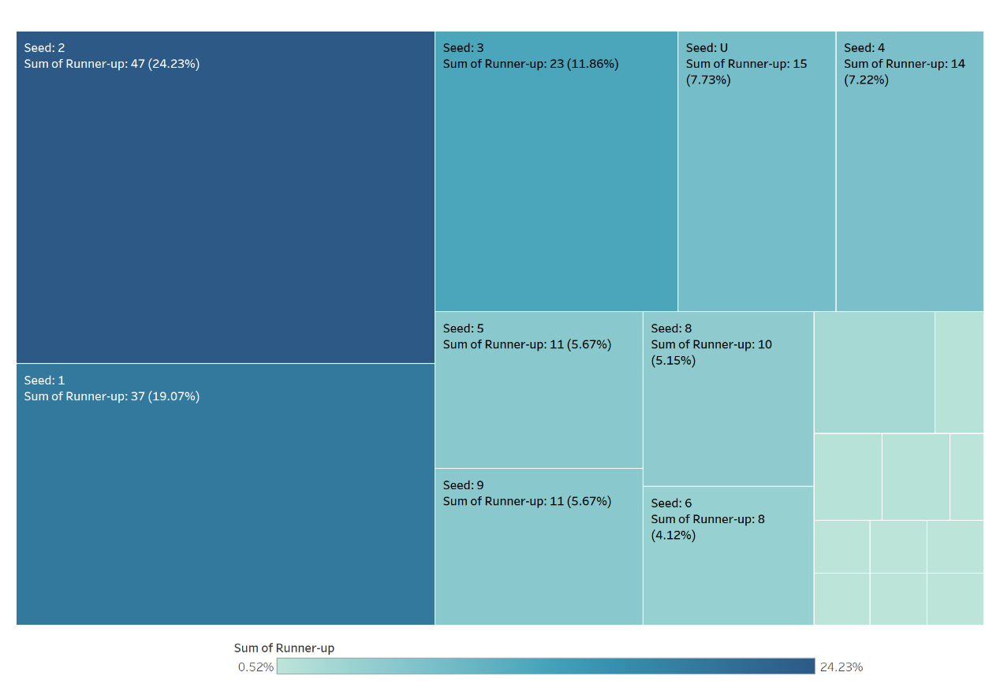

It is worth to take a closer look at when those unseeded players reached the finals. From the chart, it's clear that before the 1970s, only three unseeded Australian players ever reached the final--and none of them won. For a long period after that, both championship and runner-up spots were dominated by seeded players (as shown earlier, many titles during that era were won by Australian top players). After the 1970s, the number of unseeded finalists rose significantly, and their nationalities became more diverse--not only from Australia but also from the UK, the US, and various other countries. However, most of them ended up as runners-up. Only two Australian players and one American--Serena Williams--won a title as unseeded players (surprisingly, Serena Williams is one of the top players).

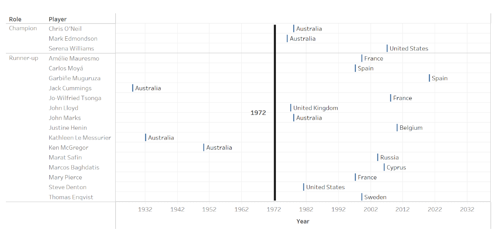

## Match Analysis

The chart below shows that 40% of men's matches were decided in just three sets, meaning one side won all three consecutively. Only 20% of matches went to the full five sets, indicating very close contests. Women's matches show a similar trend--since women play best-of-three sets, 66% of matches were decided in the first two, suggesting that one player won both straight sets.

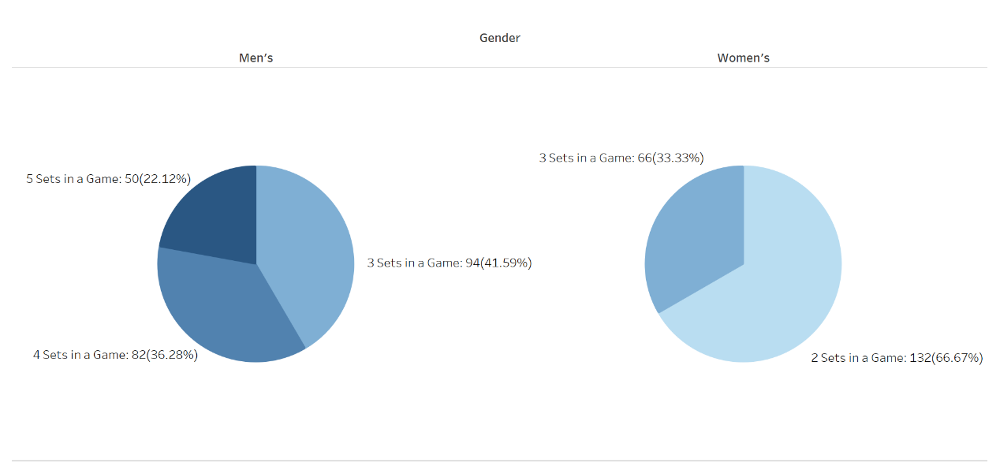

## Conclusion

This report begins with an analysis of the original dataset, revealing several patterns--for instance, inconsistencies in the number of men's and women's matches, some years without tournaments, and one year in which the tournament was held twice. Additionally, the status of each attribute in the dataset was examined, uncovering anomalies such as the "Mins" column being almost entirely empty, missing values in the "Seed" column, inconsistent formatting in the "Year" column, and data redundancy in certain fields. To facilitate subsequent analysis, some columns were merged, and new columns--such as win rate and whether the player won the championship--were added.

In the visualization analysis, the country-wise statistics showed that Australia has won the most championships, followed by the United States. A deeper look revealed that Australia held a dominant position before 1978, while post-1978, the U.S. and several European countries became more prominent, with Australia rarely winning titles after that. An analysis of gender performance in major countries found that Australia performed better in men's matches, whereas the U.S. excelled in women's matches. Additionally, a few countries were identified where all participating players were either male or female.

An analysis of different players from the same country showed that for Australia, the U.S., and the U.K., championships were mostly won by a large number of players with only one or two titles. In contrast, countries like Serbia had all their titles won by a single player. The player-level analysis identified several top-performing players whose performances were examined in detail. These players were found to have high win rates. There were also clear generational patterns: the four top Australian players were active before 1972, with no prominent Australian players afterward, while top players from other countries began winning titles frequently after 2003. One player was found to have the longest gap between first and last championship wins--19 years.

The analysis of seeded players concluded that the seeding system for this tournament is relatively reasonable, as the top seed frequently wins the championship. It was also noted that it wasn't until the 1970s that unseeded players began appearing frequently in finals. Lastly, match length analysis revealed that most matches ended within two or three sets.
