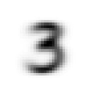
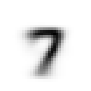
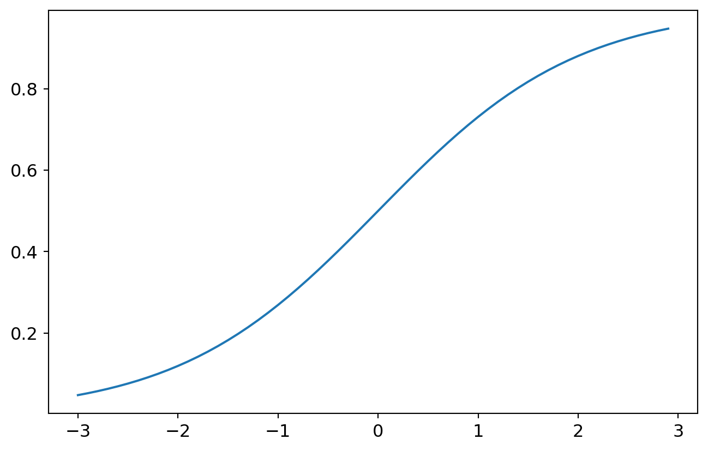

## Environment Set-up

``` python
import fastbook
from fastai.vision.all import *
from fastbook import *

fastbook.setup_book()
matplotlib.rc("image", cmap="Greys")
```

## Load The Two Classes of Data

``` python
path = untar_data(URLs.MNIST_SAMPLE)
Path.BASE_PATH = path
path.ls()
```

    (#3) [Path('train'),Path('valid'),Path('labels.csv')]

``` python
threes = [tensor(Image.open(i)) for i in (path / "train" / "3").ls()]
sevens = [tensor(Image.open(i)) for i in (path / "train" / "7").ls()]
threes_valid = [tensor(Image.open(i)) for i in (path / "valid" / "3").ls()]
sevens_valid = [tensor(Image.open(i)) for i in (path / "valid" / "7").ls()]
len(threes), len(sevens)
```

    (6131, 6265)

``` python
threes = torch.stack(threes).float() / 255
sevens = torch.stack(sevens).float() / 255
threes_valid = torch.stack(threes_valid).float() / 255
sevens_valid = torch.stack(sevens_valid).float() / 255
threes.shape, sevens.shape
```

    (torch.Size([6131, 28, 28]), torch.Size([6265, 28, 28]))

## Non-Parametric Method

Calculate an "average three"

``` python
mean3 = threes.mean(0)
show_image(mean3)
```



Calculate an "average seven"

``` python
mean7 = sevens.mean(0)
show_image(mean7)
```



Define a function that computes distance between two images and a function that judges if an image is three.

``` python
def distance(a, b):
    return (a - b).abs().mean((-1, -2))


def is_3(x):
    return distance(x, mean3) < distance(x, mean7)
```

Compute how many threes are correctly classified into class three and how many seven are correctly classified into seven. (accuracy)

``` python
is_3(threes_valid).float().mean(), (1 - is_3(sevens_valid).float()).float().mean()
```

    (tensor(0.9168), tensor(0.9854))

Compute overall how many images are correctly classified.

``` python
x = torch.cat([threes_valid, sevens_valid])
y = tensor([1] * len(threes_valid) + [0] * len(sevens_valid))
x.shape, y.shape

# ((distance(x, mean3) < distance(x, mean7)).float() == y).float().mean()
```

    (torch.Size([2038, 28, 28]), torch.Size([2038]))

## Linear Function and SGD

``` python
train_x = torch.cat([threes, sevens]).view([-1, 28 * 28])
train_y = tensor([1] * len(threes) + [0] * len(sevens)).unsqueeze(-1)
valid_x = torch.cat([threes_valid, sevens_valid]).view([-1, 28 * 28])
valid_y = tensor([1] * len(threes_valid) + [0] * len(sevens_valid)).unsqueeze(-1)
train_x.shape, train_y.shape, valid_x.shape, valid_y.shape
```

    (torch.Size([12396, 784]),
     torch.Size([12396, 1]),
     torch.Size([2038, 784]),
     torch.Size([2038, 1]))

``` python
dset = list(zip(train_x, train_y))
dset_valid = list(zip(valid_x, valid_y))
dset[0][0].shape, dset[0][1].shape

dl = DataLoader(dset, batch_size=256, shuffle=true)
valid_dl = DataLoader(dset_valid, batch_size=256, shuffle=true)
```

Differentiate `unsqueeze`, `cat` and `stack`:

1.  `cat` and `stack` operate on multiple tensors, combining them into a single tensor, whereas `unsqueeze` operates on a single tensor.
2.  `unsqueeze` and `stack` introduce a new dimension to the tensor(s), while `cat` does not create new dimensions.
3.  `stack` inserts a new dimension at the specified position, and its length equals the number of tensors being stacked.
4.  `cat` concatenates tensors along a specified dimension, and the resulting dimension's length is the sum of the lengths of all tensors along that dimension.
5.  `unsqueeze` always inserts a new dimension of length **1** at the specified position.

For example:

``` python
a, b = tensor([[1, 2, 3], [4, 5, 6]]), tensor([[7, 8, 9], [1, 2, 1]])
a.shape, b.shape
```

    (torch.Size([2, 3]), torch.Size([2, 3]))

``` python
a, b
```

    (tensor([[1, 2, 3],
             [4, 5, 6]]),
     tensor([[7, 8, 9],
             [1, 2, 1]]))

`cat` these two tensors results in a tensor with a shape of either (4, 3) or (2, 6)

``` python
torch.cat([a, b], 0).shape, torch.cat([a, b], 1).shape
```

    (torch.Size([4, 3]), torch.Size([2, 6]))

`stack` these two tensors results in a tensor with a shape of either (2, 2, 3) or (2, 3, 2)

``` python
torch.stack([a, b], 0).shape, torch.stack([a, b], 1).shape, torch.stack([a, b], 2).shape
```

    (torch.Size([2, 2, 3]), torch.Size([2, 2, 3]), torch.Size([2, 3, 2]))

Note: although `torch.stack([a, b], 0)` and `torch.stack([a, b], 1)` produce tensors with the same shape, they have different content.

$$
\begin{matrix}
[1 & 2 & 3] \\
[4 & 5 & 6]
\end{matrix}
\quad
\begin{matrix}
[7 & 8 & 9] \\
[1 & 2 & 1]
\end{matrix}
$$

`torch.stack([a, b], 0)` means stack whole matrices:

$$
\left[
\begin{matrix}
[1 & 2 & 3] \\
[4 & 5 & 6]
\end{matrix}
\right]
,
\left[
\begin{matrix}
[7 & 8 & 9] \\
[1 & 2 & 1]
\end{matrix}
\right]
$$

`torch.stack([a, b], 1)` means stack rows:

$$
\begin{matrix}
\textbf{[}[1 & 2 & 3]\quad[7 & 8 & 9]\textbf{]},\\
\\
\textbf{[}[4 & 5 & 6]\quad[1 & 2 & 1]\textbf{]}
\end{matrix}
$$

`torch.stack([a, b], 2)` means stack columns.

``` python
torch.stack([a, b], 0), torch.stack([a, b], 1)
```

    (tensor([[[1, 2, 3],
              [4, 5, 6]],
     
             [[7, 8, 9],
              [1, 2, 1]]]),
     tensor([[[1, 2, 3],
              [7, 8, 9]],
     
             [[4, 5, 6],
              [1, 2, 1]]]))

``` python
def sigmoid(logits):
    return 1 / (1 + torch.exp(-logits))


def mnist_loss(logits, targets):
    probs = logits.sigmoid()
    # return ((probs - targets) ** 2).mean().sqrt()
    return torch.where(targets == 1, 1 - probs, probs).mean()


def calc_grad(x, y, f):
    preds = f(x)
    loss = mnist_loss(preds, y)
    loss.backward()


def train_epoch(f, params, lr):
    for xb, yb in dl:
        calc_grad(xb, yb, f)
        for p in params:
            with torch.no_grad():
                p -= lr * p.grad
                p.grad.zero_()


def batch_accuracy(logits, yb):
    probs = logits.sigmoid()
    return ((probs > 0.5) == yb).float().mean()


def validation_epoch(f):
    accs = [batch_accuracy(f(xb), yb) for xb, yb in valid_dl]
    return round(torch.stack(accs).mean().item(), 4)
```

``` python
def init_params(size, std=1.0):
    return (torch.randn(size) * std).requires_grad_()


# column vector
weights = init_params((28 * 28, 1))
bias = init_params(1)


def linear(x):
    return x @ weights + bias


for i in range(20):
    train_epoch(linear, (weights, bias), 1e-1)
    print(validation_epoch(linear))
```

    0.5922
    0.661
    0.7257
    0.7738
    0.81
    0.8296
    0.8471
    0.8597
    0.8704
    0.8812
    0.8907
    0.8976
    0.9034
    0.9107
    0.9152
    0.9176
    0.924
    0.9274
    0.9302
    0.9322

## Optimizer

``` python
linear_model = nn.Linear(28 * 28, 1)
w, b = linear_model.parameters()
w.shape, b.shape
```

    (torch.Size([1, 784]), torch.Size([1]))

``` python
class BasicOptimizer:
    def __init__(self, params, lr):
        self.params = list(params)
        self.lr = lr

    def step(self, *args, **kwargs):
        for p in self.params:
            with torch.no_grad():
                p -= self.lr * p.grad

    def zero_grad(self, *args, **kwargs):
        for p in self.params:
            p.grad = None


opt = BasicOptimizer(linear_model.parameters(), 1e-2)


def train_epoch(model):
    for xb, yb in dl:
        calc_grad(xb, yb, model)
        opt.step()
        opt.zero_grad()


validation_epoch(linear_model)
```

    0.5231

``` python
for i in range(20):
    print(validation_epoch(linear_model))
    train_epoch(linear_model)
```

    0.5228
    0.9509
    0.9628
    0.9633
    0.9643
    0.9646
    0.9666
    0.9667
    0.9657
    0.9667
    0.9666
    0.9667
    0.967
    0.9672
    0.9672
    0.9675
    0.9677
    0.9676
    0.9676
    0.9686

``` python
linear_model = nn.Linear(28 * 28, 1)
opt = SGD(linear_model.parameters(), 1.0)
for i in range(20):
    train_epoch(linear_model)
    print(validation_epoch(linear_model))
```

    0.9706
    0.975
    0.977
    0.9764
    0.9779
    0.9784
    0.9784
    0.9794
    0.9799
    0.9789
    0.9803
    0.9804
    0.9813
    0.9809
    0.9814
    0.9819
    0.9824
    0.9819
    0.9818
    0.9828

## Learner

``` python
dls = DataLoaders(dl, valid_dl)
learn = Learner(
    dls,
    nn.Linear(28 * 28, 1),
    opt_func=SGD,
    loss_func=mnist_loss,
    metrics=batch_accuracy,
)
learn.fit(10, lr=1.0)
```

<style>
    /* Turns off some styling */
    progress {
        /* gets rid of default border in Firefox and Opera. */
        border: none;
        /* Needs to be in here for Safari polyfill so background images work as expected. */
        background-size: auto;
    }
    progress:not([value]), progress:not([value])::-webkit-progress-bar {
        background: repeating-linear-gradient(45deg, #7e7e7e, #7e7e7e 10px, #5c5c5c 10px, #5c5c5c 20px);
    }
    .progress-bar-interrupted, .progress-bar-interrupted::-webkit-progress-bar {
        background: #F44336;
    }
</style>

| epoch | train_loss | valid_loss | batch_accuracy | time  |
|-------|------------|------------|----------------|-------|
| 0     | 0.057635   | 0.041314   | 0.971050       | 00:00 |
| 1     | 0.039915   | 0.034953   | 0.974975       | 00:00 |
| 2     | 0.032067   | 0.032012   | 0.974975       | 00:00 |
| 3     | 0.027766   | 0.029371   | 0.977429       | 00:00 |
| 4     | 0.025469   | 0.028556   | 0.977429       | 00:00 |
| 5     | 0.023680   | 0.027128   | 0.978410       | 00:00 |
| 6     | 0.022530   | 0.026477   | 0.978410       | 00:00 |
| 7     | 0.021128   | 0.025687   | 0.978410       | 00:00 |
| 8     | 0.020596   | 0.024973   | 0.978410       | 00:00 |
| 9     | 0.020155   | 0.024411   | 0.979882       | 00:00 |

## Nonlinearity

``` python
simple_net = nn.Sequential(nn.Linear(28 * 28, 30), nn.ReLU(), nn.Linear(30, 1))
learn = Learner(dls, simple_net, mnist_loss, SGD, metrics=batch_accuracy)
learn.fit(40, 0.1)
```

<style>
    /* Turns off some styling */
    progress {
        /* gets rid of default border in Firefox and Opera. */
        border: none;
        /* Needs to be in here for Safari polyfill so background images work as expected. */
        background-size: auto;
    }
    progress:not([value]), progress:not([value])::-webkit-progress-bar {
        background: repeating-linear-gradient(45deg, #7e7e7e, #7e7e7e 10px, #5c5c5c 10px, #5c5c5c 20px);
    }
    .progress-bar-interrupted, .progress-bar-interrupted::-webkit-progress-bar {
        background: #F44336;
    }
</style>

| epoch | train_loss | valid_loss | batch_accuracy | time  |
|-------|------------|------------|----------------|-------|
| 0     | 0.209871   | 0.085825   | 0.965653       | 00:00 |
| 1     | 0.102153   | 0.052868   | 0.968106       | 00:00 |
| 2     | 0.064107   | 0.043419   | 0.970069       | 00:00 |
| 3     | 0.047004   | 0.038965   | 0.970559       | 00:00 |
| 4     | 0.038722   | 0.036753   | 0.972522       | 00:00 |
| 5     | 0.033846   | 0.034248   | 0.972522       | 00:00 |
| 6     | 0.030684   | 0.032698   | 0.973994       | 00:00 |
| 7     | 0.028295   | 0.031133   | 0.975957       | 00:00 |
| 8     | 0.026498   | 0.030240   | 0.974975       | 00:00 |
| 9     | 0.025480   | 0.029235   | 0.975957       | 00:00 |
| 10    | 0.024493   | 0.028573   | 0.976938       | 00:00 |
| 11    | 0.023539   | 0.028091   | 0.976448       | 00:00 |
| 12    | 0.022644   | 0.027519   | 0.976938       | 00:00 |
| 13    | 0.021782   | 0.026868   | 0.977429       | 00:00 |
| 14    | 0.021953   | 0.026348   | 0.977920       | 00:00 |
| 15    | 0.021738   | 0.025783   | 0.978901       | 00:00 |
| 16    | 0.021042   | 0.025252   | 0.979392       | 00:00 |
| 17    | 0.020344   | 0.024917   | 0.978901       | 00:00 |
| 18    | 0.019776   | 0.024747   | 0.978901       | 00:00 |
| 19    | 0.019557   | 0.024295   | 0.978901       | 00:00 |
| 20    | 0.019418   | 0.024097   | 0.978901       | 00:00 |
| 21    | 0.018741   | 0.023782   | 0.978901       | 00:00 |
| 22    | 0.018383   | 0.023266   | 0.979392       | 00:00 |
| 23    | 0.018047   | 0.023283   | 0.979882       | 00:00 |
| 24    | 0.017762   | 0.023139   | 0.979882       | 00:00 |
| 25    | 0.017672   | 0.022712   | 0.979882       | 00:00 |
| 26    | 0.017658   | 0.022521   | 0.980864       | 00:00 |
| 27    | 0.017558   | 0.022226   | 0.980864       | 00:00 |
| 28    | 0.017126   | 0.022203   | 0.980864       | 00:00 |
| 29    | 0.017070   | 0.021634   | 0.980864       | 00:00 |
| 30    | 0.016443   | 0.021636   | 0.981354       | 00:00 |
| 31    | 0.016697   | 0.021468   | 0.981354       | 00:00 |
| 32    | 0.016811   | 0.021725   | 0.981845       | 00:00 |
| 33    | 0.016300   | 0.021180   | 0.982336       | 00:00 |
| 34    | 0.016316   | 0.021147   | 0.981845       | 00:00 |
| 35    | 0.015825   | 0.020846   | 0.982336       | 00:00 |
| 36    | 0.015894   | 0.020525   | 0.982336       | 00:00 |
| 37    | 0.015442   | 0.020475   | 0.982336       | 00:00 |
| 38    | 0.015356   | 0.020404   | 0.982336       | 00:00 |
| 39    | 0.015186   | 0.020286   | 0.982336       | 00:00 |

## Deeper

``` python
dls = ImageDataLoaders.from_folder(path)
learn = vision_learner(
    dls, resnet18, pretrained=False, loss_func=F.cross_entropy, metrics=accuracy
)
learn.fit_one_cycle(1, 0.1)
```

<style>
    /* Turns off some styling */
    progress {
        /* gets rid of default border in Firefox and Opera. */
        border: none;
        /* Needs to be in here for Safari polyfill so background images work as expected. */
        background-size: auto;
    }
    progress:not([value]), progress:not([value])::-webkit-progress-bar {
        background: repeating-linear-gradient(45deg, #7e7e7e, #7e7e7e 10px, #5c5c5c 10px, #5c5c5c 20px);
    }
    .progress-bar-interrupted, .progress-bar-interrupted::-webkit-progress-bar {
        background: #F44336;
    }
</style>

| epoch | train_loss | valid_loss | accuracy | time  |
|-------|------------|------------|----------|-------|
| 0     | 0.059510   | 0.017087   | 0.992640 | 00:12 |

## Questionnaire

1.  How is a grayscale image represented on a computer? How about a color image?

    each pixel is represented by a number from 0 to 255. 0 represents black and 255 represents white. pixels of color image are represented by three colors: red, green and blue (RGB).

2.  How are the files and folders in the `MNIST_SAMPLE` dataset structured? Why?

    tree structure

3.  Explain how the "pixel similarity" approach to classifying digits works.

    mean3 and mean7 can be considered as "standard shapes". if the average distance between an image's pixels and mean3's pixels is smaller, it is probably a three and vice versa.

4.  What is a list comprehension? Create one now that selects odd numbers from a list and doubles them.

    Create a python list within one line.

    ``` python
    l = [1, 4, 3, 6, 8, 9, 10, 3, 4]
    [i * 2 for i in l if i % 2 != 0]
    ```

        [2, 6, 18, 6]

5.  What is a "rank-3 tensor"?

    a tensor that has three dimensions, for example:

    ``` python
    [[[1, 2], [3, 4]], [[5, 6], [7, 8]]]
    ```

        [[[1, 2], [3, 4]], [[5, 6], [7, 8]]]

6.  What is the difference between tensor rank and shape? How do you get the rank from the shape?

    rank is the length of shape, `len(shape)`.

7.  What are RMSE and L1 norm?

    RMSE uses square power to avoid cancelling out while L1 norm uses absolute value to do so.

8.  How can you apply a calculation on thousands of numbers at once, many thousands of times faster than a Python loop?

    Using `np.array` or `tensor` and broadcasting

9.  Create a 3×3 tensor or array containing the numbers from 1 to 9. Double it. Select the bottom-right four numbers.

    ``` python
    import numpy as np

    a = np.arange(1, 10).reshape(3, 3)
    print(a)
    a = a * 2
    print(a[-2:, -2:])
    ```

        [[1 2 3]
         [4 5 6]
         [7 8 9]]
        [[10 12]
         [16 18]]

10. What is broadcasting?

11. Are metrics generally calculated using the training set, or the validation set? Why?

    they are generally calculated using the validation set because it refects the generalization ability of a model

12. What is SGD?

    stochastic: stochastically sample batchs from the dataset
    gradient: update parameters according to its gradient
    descent: the loss function is convex thus finding minimum descenting

13. Why does SGD use mini-batches?

    Using the whole dataset is computationally expensive and using on data point results in unstable gradient. Using mini-batches is a compromise between them.

14. What are the seven steps in SGD for machine learning?

15. How do we initialize the weights in a model?

    randomly

16. What is "loss"?

    loss funtions measure the difference between a model's predictions and the true target values. It provides a quantitative way to evaluate how well a model is performing. lower loss means better performance.

17. Why can't we always use a high learning rate?

    because it my cause the optimization process to overshoot the minimum. In extreme cases, the loss even increase or diverge instead of decreasing.

18. What is a "gradient"?

19. Do you need to know how to calculate gradients yourself?

    No, I don't. Even though I know.

20. Why can't we use accuracy as a loss function?

    because accuracy is not a continuous function with respect to the model's parameters, which means when parameters' value shift a bit, the accuracy won't change, preventing calculating the gradient.

21. Draw the sigmoid function. What is special about its shape?

    ``` python
    import numpy as np
    import matplotlib.pyplot as plt


    def sigmoid(x):
        return 1 / (1 + np.exp(-x))


    plt.plot(np.arange(-3, 3, 0.1), sigmoid(np.arange(-3, 3, 0.1)))
    plt.show()
    ```

    

    Its domain is \((-\infty, +\infty)\), and its range is \((0, 1)\). This means it squashes any real value into the interval \((0, 1)\), which makes it suitable for representing probabilities.

22. What is the difference between a loss function and a metric?

    the loss function is used for the model while a metric should be meaingful for humans.

23. What is the function to calculate new weights using a learning rate?

24. What does the `DataLoader` class do?

25. Write pseudocode showing the basic steps taken in each epoch for SGD.

26. Create a function that, if passed two arguments `[1,2,3,4]` and `'abcd'`, returns `[(1, 'a'), (2, 'b'), (3, 'c'), (4, 'd')]`. What is special about that output data structure?

27. What does `view` do in PyTorch?

28. What are the "bias" parameters in a neural network? Why do we need them?

29. What does the `@` operator do in Python?

30. What does the `backward` method do?

31. Why do we have to zero the gradients?

32. What information do we have to pass to `Learner`?

33. Show Python or pseudocode for the basic steps of a training loop.

34. What is "ReLU"? Draw a plot of it for values from `-2` to `+2`.

35. What is an "activation function"?

36. What's the difference between `F.relu` and `nn.ReLU`?

37. The universal approximation theorem shows that any function can be approximated as closely as needed using just one nonlinearity. So why do we normally use more?
