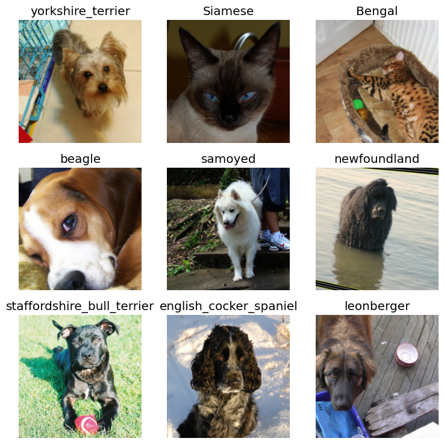
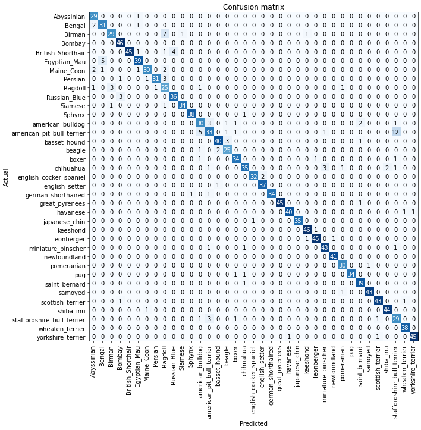
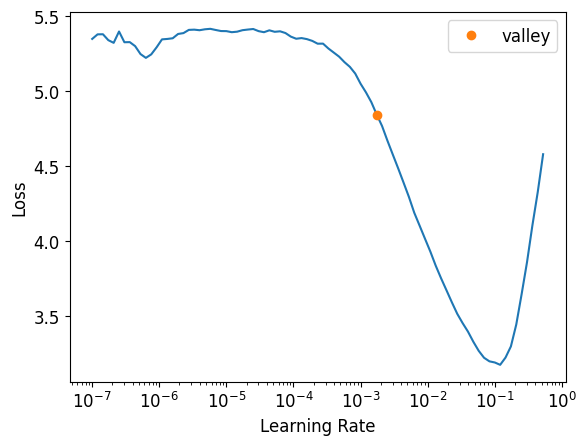
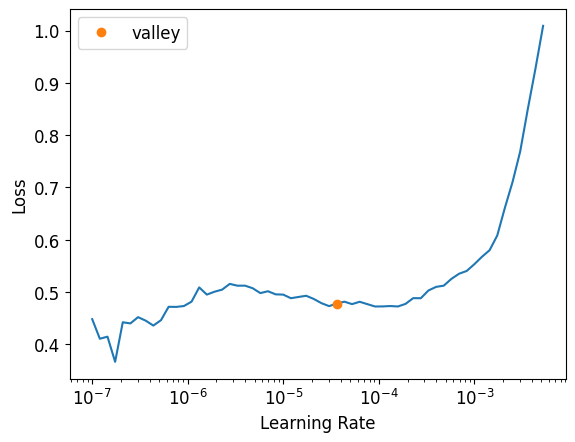
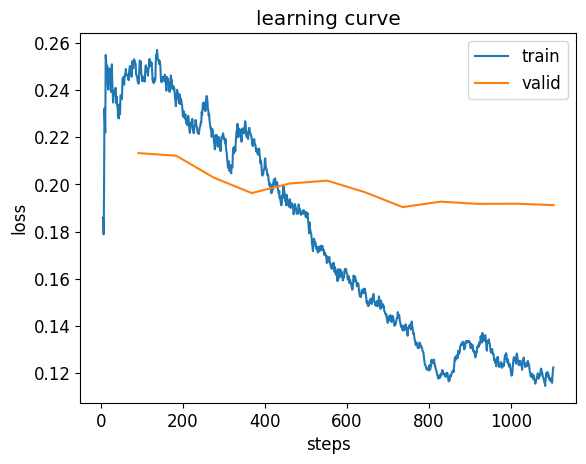

``` python
import fastbook
fastbook.setup_book()
```

``` python
from fastai.vision.all import *
path = untar_data(URLs.PETS)
```

``` python
path.ls()
```

    (#2) [Path('/root/.fastai/data/oxford-iiit-pet/annotations'),Path('/root/.fastai/data/oxford-iiit-pet/images')]

``` python
pets = DataBlock(
    blocks=(ImageBlock, CategoryBlock),
    get_items=get_image_files,
    splitter=RandomSplitter(seed=42),
    get_y=using_attr(RegexLabeller(r"(.+)_\d+.jpg$"), "name"),
    item_tfms=Resize(460),
    batch_tfms=aug_transforms(size=224, min_scale=0.75),
)
dls = pets.dataloaders(path/"images")
```

``` python
dls.show_batch(nrows=3, ncols=3)
```



``` python
learn = cnn_learner(dls, resnet34, metrics=error_rate)
learn.fine_tune(2)
```

    Downloading: "https://download.pytorch.org/models/resnet34-b627a593.pth" to /root/.cache/torch/hub/checkpoints/resnet34-b627a593.pth

<style>
    /* Turns off some styling */
    progress {
        /* gets rid of default border in Firefox and Opera. */
        border: none;
        /* Needs to be in here for Safari polyfill so background images work as expected. */
        background-size: auto;
    }
    progress:not([value]), progress:not([value])::-webkit-progress-bar {
        background: repeating-linear-gradient(45deg, #7e7e7e, #7e7e7e 10px, #5c5c5c 10px, #5c5c5c 20px);
    }
    .progress-bar-interrupted, .progress-bar-interrupted::-webkit-progress-bar {
        background: #F44336;
    }
</style>

| epoch | train_loss | valid_loss | error_rate | time  |
|-------|------------|------------|------------|-------|
| 0     | 1.497884   | 0.302666   | 0.087280   | 01:02 |

<style>
    /* Turns off some styling */
    progress {
        /* gets rid of default border in Firefox and Opera. */
        border: none;
        /* Needs to be in here for Safari polyfill so background images work as expected. */
        background-size: auto;
    }
    progress:not([value]), progress:not([value])::-webkit-progress-bar {
        background: repeating-linear-gradient(45deg, #7e7e7e, #7e7e7e 10px, #5c5c5c 10px, #5c5c5c 20px);
    }
    .progress-bar-interrupted, .progress-bar-interrupted::-webkit-progress-bar {
        background: #F44336;
    }
</style>

| epoch | train_loss | valid_loss | error_rate | time  |
|-------|------------|------------|------------|-------|
| 0     | 0.494630   | 0.309310   | 0.099459   | 01:04 |
| 1     | 0.310687   | 0.254076   | 0.084574   | 01:06 |

``` python
x, y = dls.one_batch()
```

``` python
preds, _ = learn.get_preds(dl = [(x,y)])
torch.argmax(preds[0])
```

<style>
    /* Turns off some styling */
    progress {
        /* gets rid of default border in Firefox and Opera. */
        border: none;
        /* Needs to be in here for Safari polyfill so background images work as expected. */
        background-size: auto;
    }
    progress:not([value]), progress:not([value])::-webkit-progress-bar {
        background: repeating-linear-gradient(45deg, #7e7e7e, #7e7e7e 10px, #5c5c5c 10px, #5c5c5c 20px);
    }
    .progress-bar-interrupted, .progress-bar-interrupted::-webkit-progress-bar {
        background: #F44336;
    }
</style>

    tensor(10)

``` python
acts = torch.randn((6,2))*2
acts
```

    tensor([[ 0.2126, -0.6733],
            [ 0.5868,  1.8977],
            [-1.5544,  0.4964],
            [-0.5226, -0.6044],
            [ 0.4885, -0.1626],
            [-3.0538, -2.0372]])

``` python
acts.sigmoid().sum(1).unsqueeze(1)
```

    tensor([[0.8907],
            [1.5123],
            [0.7961],
            [0.7256],
            [1.0792],
            [0.1604]])

``` python
(acts[:,0]-acts[:,1]).sigmoid().unsqueeze(1)
```

    tensor([[0.7080],
            [0.2123],
            [0.1140],
            [0.5204],
            [0.6573],
            [0.2657]])

``` python
def softmax(x): return torch.exp(x) / torch.exp(x).sum(dim=1, keepdim=True)
sm_acts = softmax(acts)
```

``` python
sm_acts
```

    tensor([[0.7080, 0.2920],
            [0.2123, 0.7877],
            [0.1140, 0.8860],
            [0.5204, 0.4796],
            [0.6573, 0.3427],
            [0.2657, 0.7343]])

``` python
targ = tensor([0,1,0,0,1,1])
sm_acts[range(6),targ].unsqueeze(1)
```

    tensor([[0.7080],
            [0.7877],
            [0.1140],
            [0.5204],
            [0.3427],
            [0.7343]])

``` python
-sm_acts[range(6),targ].log().mean()
```

    tensor(0.7981)

``` python
F.nll_loss(acts.log_softmax(dim=1), targ)
```

    tensor(0.7981)

``` python
loss_func = nn.CrossEntropyLoss(reduction='none')
loss_func(acts, targ)
```

    tensor([0.3452, 0.2387, 2.1718, 0.6531, 1.0708, 0.3088])

``` python
interp  = ClassificationInterpretation.from_learner(learn)
interp.plot_confusion_matrix(figsize=(12,12), dpi=60)
```

<style>
    /* Turns off some styling */
    progress {
        /* gets rid of default border in Firefox and Opera. */
        border: none;
        /* Needs to be in here for Safari polyfill so background images work as expected. */
        background-size: auto;
    }
    progress:not([value]), progress:not([value])::-webkit-progress-bar {
        background: repeating-linear-gradient(45deg, #7e7e7e, #7e7e7e 10px, #5c5c5c 10px, #5c5c5c 20px);
    }
    .progress-bar-interrupted, .progress-bar-interrupted::-webkit-progress-bar {
        background: #F44336;
    }
</style>


<style>
    /* Turns off some styling */
    progress {
        /* gets rid of default border in Firefox and Opera. */
        border: none;
        /* Needs to be in here for Safari polyfill so background images work as expected. */
        background-size: auto;
    }
    progress:not([value]), progress:not([value])::-webkit-progress-bar {
        background: repeating-linear-gradient(45deg, #7e7e7e, #7e7e7e 10px, #5c5c5c 10px, #5c5c5c 20px);
    }
    .progress-bar-interrupted, .progress-bar-interrupted::-webkit-progress-bar {
        background: #F44336;
    }
</style>



``` python
interp.most_confused(min_val=5)
```

<style>
    /* Turns off some styling */
    progress {
        /* gets rid of default border in Firefox and Opera. */
        border: none;
        /* Needs to be in here for Safari polyfill so background images work as expected. */
        background-size: auto;
    }
    progress:not([value]), progress:not([value])::-webkit-progress-bar {
        background: repeating-linear-gradient(45deg, #7e7e7e, #7e7e7e 10px, #5c5c5c 10px, #5c5c5c 20px);
    }
    .progress-bar-interrupted, .progress-bar-interrupted::-webkit-progress-bar {
        background: #F44336;
    }
</style>

    [('american_pit_bull_terrier', 'staffordshire_bull_terrier', np.int64(12)),
     ('Birman', 'Ragdoll', np.int64(7)),
     ('Egyptian_Mau', 'Bengal', np.int64(5)),
     ('american_pit_bull_terrier', 'american_bulldog', np.int64(5))]

``` python
learn = vision_learner(dls, resnet34, metrics=error_rate)
learn.lr_find()
```

<style>
    /* Turns off some styling */
    progress {
        /* gets rid of default border in Firefox and Opera. */
        border: none;
        /* Needs to be in here for Safari polyfill so background images work as expected. */
        background-size: auto;
    }
    progress:not([value]), progress:not([value])::-webkit-progress-bar {
        background: repeating-linear-gradient(45deg, #7e7e7e, #7e7e7e 10px, #5c5c5c 10px, #5c5c5c 20px);
    }
    .progress-bar-interrupted, .progress-bar-interrupted::-webkit-progress-bar {
        background: #F44336;
    }
</style>

    SuggestedLRs(valley=0.001737800776027143)



``` python
learn = vision_learner(dls, resnet34, metrics=error_rate)
learn.fine_tune(2, base_lr=3e-3)
```

<style>
    /* Turns off some styling */
    progress {
        /* gets rid of default border in Firefox and Opera. */
        border: none;
        /* Needs to be in here for Safari polyfill so background images work as expected. */
        background-size: auto;
    }
    progress:not([value]), progress:not([value])::-webkit-progress-bar {
        background: repeating-linear-gradient(45deg, #7e7e7e, #7e7e7e 10px, #5c5c5c 10px, #5c5c5c 20px);
    }
    .progress-bar-interrupted, .progress-bar-interrupted::-webkit-progress-bar {
        background: #F44336;
    }
</style>

| epoch | train_loss | valid_loss | error_rate | time  |
|-------|------------|------------|------------|-------|
| 0     | 1.330929   | 0.305042   | 0.089986   | 01:07 |

<style>
    /* Turns off some styling */
    progress {
        /* gets rid of default border in Firefox and Opera. */
        border: none;
        /* Needs to be in here for Safari polyfill so background images work as expected. */
        background-size: auto;
    }
    progress:not([value]), progress:not([value])::-webkit-progress-bar {
        background: repeating-linear-gradient(45deg, #7e7e7e, #7e7e7e 10px, #5c5c5c 10px, #5c5c5c 20px);
    }
    .progress-bar-interrupted, .progress-bar-interrupted::-webkit-progress-bar {
        background: #F44336;
    }
</style>

| epoch | train_loss | valid_loss | error_rate | time  |
|-------|------------|------------|------------|-------|
| 0     | 0.523440   | 0.362486   | 0.104871   | 01:10 |
| 1     | 0.327184   | 0.269103   | 0.080514   | 01:06 |

``` python
learn = vision_learner(dls, resnet34, metrics=error_rate)
learn.fit_one_cycle(3, 3e-2)
```

<style>
    /* Turns off some styling */
    progress {
        /* gets rid of default border in Firefox and Opera. */
        border: none;
        /* Needs to be in here for Safari polyfill so background images work as expected. */
        background-size: auto;
    }
    progress:not([value]), progress:not([value])::-webkit-progress-bar {
        background: repeating-linear-gradient(45deg, #7e7e7e, #7e7e7e 10px, #5c5c5c 10px, #5c5c5c 20px);
    }
    .progress-bar-interrupted, .progress-bar-interrupted::-webkit-progress-bar {
        background: #F44336;
    }
</style>

| epoch | train_loss | valid_loss | error_rate | time  |
|-------|------------|------------|------------|-------|
| 0     | 2.357152   | 3.695568   | 0.578484   | 00:12 |
| 1     | 1.188880   | 0.541915   | 0.169824   | 00:11 |
| 2     | 0.660204   | 0.358833   | 0.108931   | 00:11 |

``` python
learn.unfreeze()
```

``` python
learn.lr_find()
```

<style>
    /* Turns off some styling */
    progress {
        /* gets rid of default border in Firefox and Opera. */
        border: none;
        /* Needs to be in here for Safari polyfill so background images work as expected. */
        background-size: auto;
    }
    progress:not([value]), progress:not([value])::-webkit-progress-bar {
        background: repeating-linear-gradient(45deg, #7e7e7e, #7e7e7e 10px, #5c5c5c 10px, #5c5c5c 20px);
    }
    .progress-bar-interrupted, .progress-bar-interrupted::-webkit-progress-bar {
        background: #F44336;
    }
</style>

    SuggestedLRs(valley=3.630780702224001e-05)



``` python
learn.fit_one_cycle(6,  lr_max=1e-6)
```

<style>
    /* Turns off some styling */
    progress {
        /* gets rid of default border in Firefox and Opera. */
        border: none;
        /* Needs to be in here for Safari polyfill so background images work as expected. */
        background-size: auto;
    }
    progress:not([value]), progress:not([value])::-webkit-progress-bar {
        background: repeating-linear-gradient(45deg, #7e7e7e, #7e7e7e 10px, #5c5c5c 10px, #5c5c5c 20px);
    }
    .progress-bar-interrupted, .progress-bar-interrupted::-webkit-progress-bar {
        background: #F44336;
    }
</style>

| epoch | train_loss | valid_loss | error_rate | time  |
|-------|------------|------------|------------|-------|
| 0     | 0.474540   | 0.356742   | 0.108931   | 00:12 |
| 1     | 0.472879   | 0.353283   | 0.110284   | 00:12 |
| 2     | 0.471576   | 0.347057   | 0.103518   | 00:12 |
| 3     | 0.464339   | 0.345362   | 0.100812   | 00:12 |
| 4     | 0.468930   | 0.342762   | 0.106225   | 00:12 |
| 5     | 0.452638   | 0.343595   | 0.103518   | 00:12 |

``` python
learn = vision_learner(dls, resnet34, metrics=error_rate)
learn.fit_one_cycle(3, 3e-3)
learn.unfreeze()
learn.fit_one_cycle(12, lr_max=slice(1e-6, 1e-4))
```

<style>
    /* Turns off some styling */
    progress {
        /* gets rid of default border in Firefox and Opera. */
        border: none;
        /* Needs to be in here for Safari polyfill so background images work as expected. */
        background-size: auto;
    }
    progress:not([value]), progress:not([value])::-webkit-progress-bar {
        background: repeating-linear-gradient(45deg, #7e7e7e, #7e7e7e 10px, #5c5c5c 10px, #5c5c5c 20px);
    }
    .progress-bar-interrupted, .progress-bar-interrupted::-webkit-progress-bar {
        background: #F44336;
    }
</style>

| epoch | train_loss | valid_loss | error_rate | time  |
|-------|------------|------------|------------|-------|
| 0     | 1.127102   | 0.334892   | 0.097429   | 00:11 |
| 1     | 0.518909   | 0.252394   | 0.085927   | 00:11 |
| 2     | 0.327980   | 0.218656   | 0.075778   | 00:11 |

<style>
    /* Turns off some styling */
    progress {
        /* gets rid of default border in Firefox and Opera. */
        border: none;
        /* Needs to be in here for Safari polyfill so background images work as expected. */
        background-size: auto;
    }
    progress:not([value]), progress:not([value])::-webkit-progress-bar {
        background: repeating-linear-gradient(45deg, #7e7e7e, #7e7e7e 10px, #5c5c5c 10px, #5c5c5c 20px);
    }
    .progress-bar-interrupted, .progress-bar-interrupted::-webkit-progress-bar {
        background: #F44336;
    }
</style>

| epoch | train_loss | valid_loss | error_rate | time  |
|-------|------------|------------|------------|-------|
| 0     | 0.243455   | 0.213250   | 0.074425   | 00:12 |
| 1     | 0.233122   | 0.212131   | 0.073748   | 00:12 |
| 2     | 0.220011   | 0.202811   | 0.063599   | 00:12 |
| 3     | 0.220371   | 0.196318   | 0.062923   | 00:12 |
| 4     | 0.191108   | 0.200352   | 0.064953   | 00:12 |
| 5     | 0.166688   | 0.201582   | 0.066982   | 00:12 |
| 6     | 0.155857   | 0.196664   | 0.062923   | 00:12 |
| 7     | 0.138741   | 0.190374   | 0.060217   | 00:12 |
| 8     | 0.118107   | 0.192674   | 0.067659   | 00:12 |
| 9     | 0.130965   | 0.191735   | 0.065629   | 00:12 |
| 10    | 0.124963   | 0.191818   | 0.066982   | 00:12 |
| 11    | 0.122479   | 0.191197   | 0.064276   | 00:12 |

``` python
learn.recorder.plot_loss()
```



``` python
from fastai.callback.fp16 import *
learn =  vision_learner(dls, resnet50, metrics=error_rate).to_fp16()
learn.fine_tune(6, freeze_epochs=3)
```

    Downloading: "https://download.pytorch.org/models/resnet50-11ad3fa6.pth" to /root/.cache/torch/hub/checkpoints/resnet50-11ad3fa6.pth

<style>
    /* Turns off some styling */
    progress {
        /* gets rid of default border in Firefox and Opera. */
        border: none;
        /* Needs to be in here for Safari polyfill so background images work as expected. */
        background-size: auto;
    }
    progress:not([value]), progress:not([value])::-webkit-progress-bar {
        background: repeating-linear-gradient(45deg, #7e7e7e, #7e7e7e 10px, #5c5c5c 10px, #5c5c5c 20px);
    }
    .progress-bar-interrupted, .progress-bar-interrupted::-webkit-progress-bar {
        background: #F44336;
    }
</style>

| epoch | train_loss | valid_loss | error_rate | time  |
|-------|------------|------------|------------|-------|
| 0     | 2.191112   | 0.475555   | 0.154263   | 00:14 |
| 1     | 0.829924   | 0.294044   | 0.100812   | 00:13 |
| 2     | 0.550020   | 0.291130   | 0.096752   | 00:13 |

<style>
    /* Turns off some styling */
    progress {
        /* gets rid of default border in Firefox and Opera. */
        border: none;
        /* Needs to be in here for Safari polyfill so background images work as expected. */
        background-size: auto;
    }
    progress:not([value]), progress:not([value])::-webkit-progress-bar {
        background: repeating-linear-gradient(45deg, #7e7e7e, #7e7e7e 10px, #5c5c5c 10px, #5c5c5c 20px);
    }
    .progress-bar-interrupted, .progress-bar-interrupted::-webkit-progress-bar {
        background: #F44336;
    }
</style>

| epoch | train_loss | valid_loss | error_rate | time  |
|-------|------------|------------|------------|-------|
| 0     | 0.305628   | 0.236669   | 0.073748   | 00:14 |
| 1     | 0.242062   | 0.278092   | 0.081867   | 00:14 |
| 2     | 0.209351   | 0.231892   | 0.069689   | 00:14 |
| 3     | 0.133353   | 0.220406   | 0.064276   | 00:14 |
| 4     | 0.089182   | 0.202463   | 0.050744   | 00:14 |
| 5     | 0.065977   | 0.192152   | 0.052774   | 00:14 |
