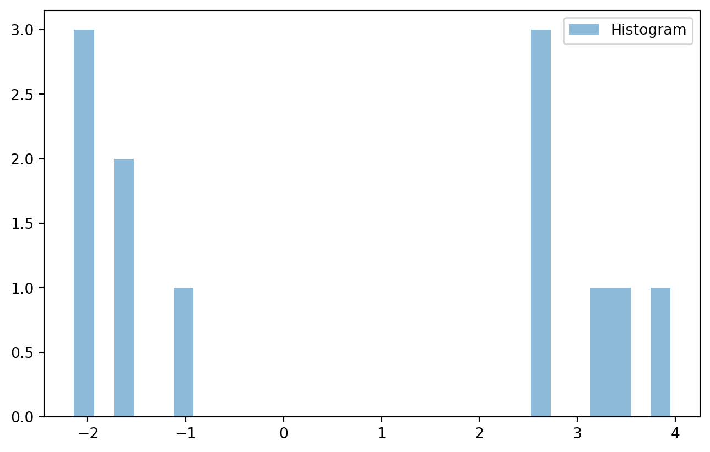
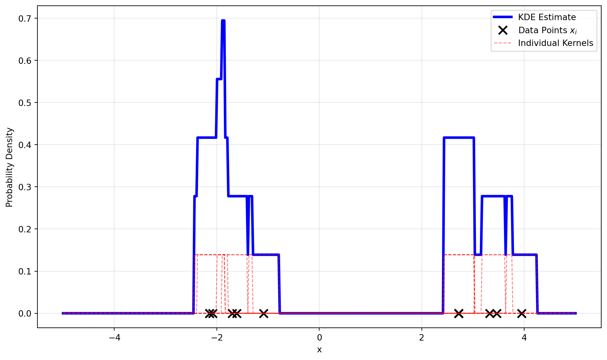
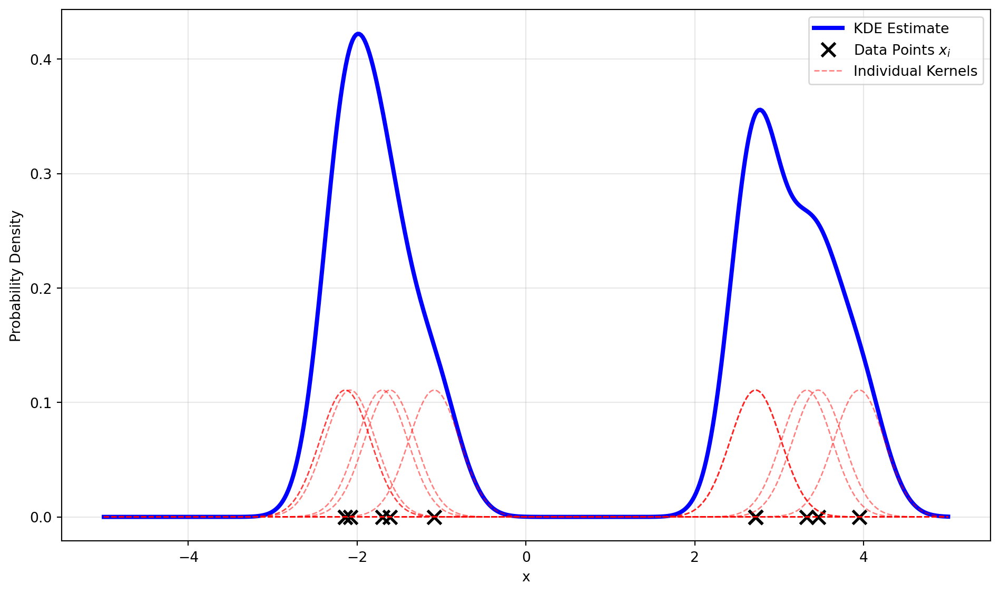
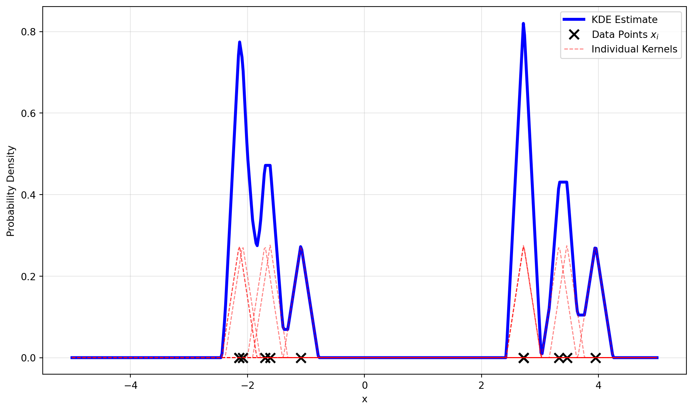

## Histogram

A very common tool for data exploration is histogram, which provides a clear visualization of the distribution of a dataset. It can be viewed as a discrete approximation of the underlying probability density function (PDF) of the data.

``` python
import numpy as np
import matplotlib.pyplot as plt


def histogram(data, bins):
    data = np.asarray(data)
    
    if isinstance(bins, int):
        bin_edges = np.linspace(data.min(), data.max(), bins + 1)
    else:
        bin_edges = np.asarray(bins)

    counts = np.zeros(len(bin_edges) - 1)
    for i in range(len(bin_edges) - 1):
        mask = (data >= bin_edges[i]) & (data < bin_edges[i + 1])
        counts[i] = np.sum(mask)

    counts[-1] += np.sum(data == bin_edges[-1])
    
    return counts, bin_edges
```

``` python
np.random.seed(42)
data = np.concatenate([np.random.normal(-2, 0.6, 6), np.random.normal(3, 0.6, 6)])
counts, bin_edges = histogram(data, bins=30)
plt.bar(
    bin_edges[:-1],
    counts,
    width=np.diff(bin_edges),
    alpha=0.5,
    align="edge",
    label="Histogram",
)
plt.legend()
plt.show()
```



## KDE

Kernel Density Estimation (KDE), on the other hand, provides a smooth estimate of the PDF of the data.

According to the definition of PDF, it is the derivative of the Cumulative Distribution Function (CDF) \(F(x)\):

$$
f(x) = F'(x) = \lim_{h \to 0} \frac{F(x+h) - F(x-h)}{2h}
$$

Here, \(F(x+h)-F(x-h)\) represents the probability that a random variable falls within the interval \([x-h, x+h]\), namely \(P(x-h \le X \le x+h)\). We can estimate this probability using the frequency. That is, we can count the number of data points that fall within this interval and divide it by the total number of data points \(N\):

$$
P(x-h \le X \le x + h) \approx \frac{\text{Count of points in } [x-h, x+h]}{N}
$$

Therefore, we can estimate the PDF as follows:

$$
\hat{f}(x) = \lim_{h \to 0} \frac{1}{2Nh} \cdot \text{Count of points in } [x-h, x+h]
$$

To express the count function mathematically, we can define an indicator function:

$$
I(u) = \begin{cases}
1 & \text{if } |u| \le 1 \\
0 & \text{if } |u| > 1
\end{cases}
$$

Here, \(u\) is a normalized distance defined as \(u = \frac{x - x_i}{h}\), where \(x_i\) represents each data point. When \(|u| < 1\), \(x_i\) falls within the interval \([x - h, x + h]\) and \(I(u) = 1\); otherwise, \(I(u) = 0\). Thus, we can express the count of points in the interval as:

$$
\text{Count of points in } [x-h, x+h] = \sum_{i=1}^{N} I\left(\frac{x - x_i}{h}\right)
$$

Correspondingly, the estimated PDF becomes:

$$
\hat{f}(x) = \frac{1}{N} \sum_{i=1}^{N} \frac{1}{2h} I\left(\frac{x - x_i}{h}\right)
$$

``` python
def compute_kde(data, xvals, h, kernel):
    N = len(data)
    u = (xvals[:, None] - data[None, :]) / h
    kernels = kernel(u)
    density = np.sum(kernels, axis=1) / (N * h)
    scaled_kernels = kernels / (N * h)
    return density, scaled_kernels


def uniform_kernel(u):
    return 0.5 * (np.abs(u) <= 1)

h = 0.3
xvals = np.linspace(-5, 5, 500)
yvals, component_curves = compute_kde(data, xvals, h, uniform_kernel)
plt.figure(figsize=(10, 6))
plt.plot(xvals, yvals, color="blue", linewidth=3, label="KDE Estimate")
plt.plot(
    data,
    np.zeros_like(data),
    "kx",
    markersize=10,
    markeredgewidth=2,
    label="Data Points $x_i$",
)

for i in range(len(data)):
    label = "Individual Kernels" if i == 0 else None
    plt.plot(
        xvals,
        component_curves[:, i],
        color="red",
        linestyle="--",
        alpha=0.5,
        linewidth=1,
        label=label,
    )
plt.xlabel("x")
plt.ylabel("Probability Density")
plt.legend()
plt.grid(True, alpha=0.3)
plt.tight_layout()
plt.show()
```



Instead of purely counting the points within the interval, which equates to using a uniform kernel, we can use other kernel functions to assign different weights to the points based on their distance from \(x\). For example, using a Gaussian kernel will produce a much smoother estimate:

``` python
def gaussian_kernel(u):
    return (1 / np.sqrt(2 * np.pi)) * np.exp(-0.5 * u**2)

yvals, component_curves = compute_kde(data, xvals, h, gaussian_kernel)
plt.figure(figsize=(10, 6))
plt.plot(xvals, yvals, color="blue", linewidth=3, label="KDE Estimate")
plt.plot(
    data,
    np.zeros_like(data),
    "kx",   
    markersize=10,
    markeredgewidth=2,
    label="Data Points $x_i$",
)

for i in range(len(data)):
    label = "Individual Kernels" if i == 0 else None
    plt.plot(
        xvals,
        component_curves[:, i],
        color="red",
        linestyle="--",
        alpha=0.5,
        linewidth=1,
        label=label,
    )
plt.xlabel("x")
plt.ylabel("Probability Density")
plt.legend()
plt.grid(True, alpha=0.3)
plt.tight_layout()
plt.show()
```



Triangular Kernel:

``` python
def triangular_kernel(u):
    return (1 - np.abs(u)) * (np.abs(u) <= 1)


yvals, component_curves = compute_kde(data, xvals, h, triangular_kernel)
plt.figure(figsize=(10, 6))
plt.plot(xvals, yvals, color="blue", linewidth=3, label="KDE Estimate")
plt.plot(
    data,
    np.zeros_like(data),
    "kx",
    markersize=10,
    markeredgewidth=2,
    label="Data Points $x_i$",
)

for i in range(len(data)):
    label = "Individual Kernels" if i == 0 else None
    plt.plot(
        xvals,
        component_curves[:, i],
        color="red",
        linestyle="--",
        alpha=0.5,
        linewidth=1,
        label=label,
    )
plt.xlabel("x")
plt.ylabel("Probability Density")
plt.legend()
plt.grid(True, alpha=0.3)
plt.tight_layout()
plt.show()
```



## Kernel Regression

Moving from estimating the probability of \(X\) to estimating the expected value of a response variable \(Y\) given \(X=x\), we can apply a similar kernel-based approach known as kernel regression.

## Attention
