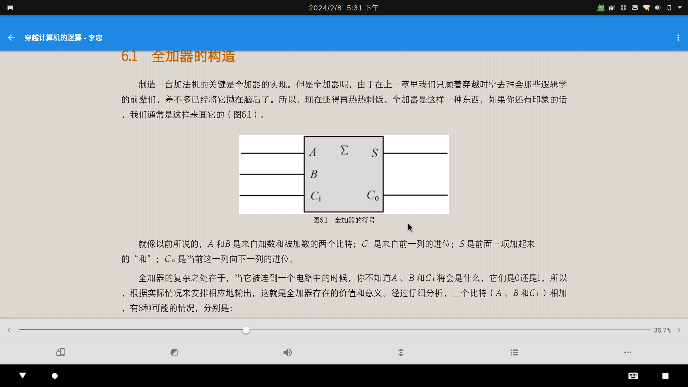

先说结论，我最终选择的办法是在 waydroid 中安装静读天下😑，waydroid 会自动创建 .desktop 文件，因此启动起来也十分方便，与原生的 linux 程序无二。  
我先后尝试了 calibre，foliate，fbreader，koodo-reader，okular，koreader 等等，还有一众OPDS，例如 calibre-web。都不甚满意，calibre 的问题是太臃肿了，而且界面很丑，阅读功能很简陋；foliate 是我最喜欢的，但是也有问题，某些 epub 文件无法修改行高，而且选择字体时经常卡死；koodo 表现也不错，但是对于某些内嵌公式的 epub 文件对公式渲染不正确；okular 阅读 pdf 表现很好，但是对 epub 的支持几乎没有。其实我的需求就是：可以正确的渲染我想看的文件；可以自定义字体；可以滚动阅读；支持修改行高和四边留白，颜值只要和 gtk 和 qt 应用统一就好。但是我尝试的应用或多或少都有些不足，没有一款能和安卓上静读天下比肩的。
恰好静读天下支持安卓x86，且 waydroid 使用起来体验也不错，于是我尝试了一下之后就决定使用这个方案了。

